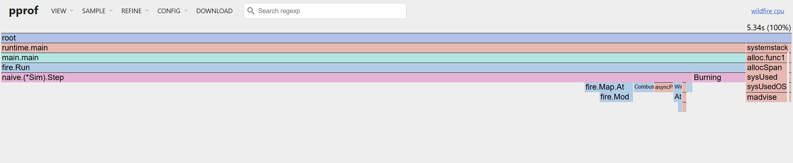
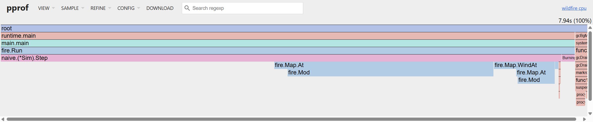
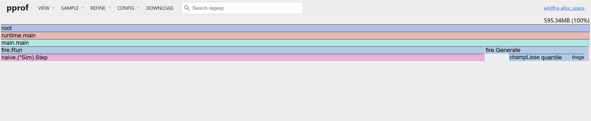

# Rapport d'audit de performance — Simulation d'incendie

> **Équipe :** … — **Session :** E42 — **Dépôt :** … (commit final : `…`)
>
> Consigne de rédaction : chaque affirmation chiffrée renvoie à un fichier de `results/`.
> Rédiger chaque section **juste après** la mesure correspondante, jamais à la fin.
>
> Les règles du modèle simulé sont spécifiées dans `internal/fire/REGLES.md` ; les renvois `§n`
> ci-dessous pointent vers ses sections. Les défauts volontaires de la baseline sont numérotés
> `[F1]`–`[F7]` en tête de `internal/naive/naive.go`.

## Résumé exécutif

Trois phrases : point de départ (débit baseline en cases/s), point d'arrivée, facteur de gain global
et les deux leviers principaux.

---

## 1. Environnement & métrologie (baseline) — /3

### 1.1 Banc d'essai matériel

Source : `results/<commit>/<banc>/env.md`, généré par `make env` au début de chaque campagne.

**Deux bancs, deux rôles distincts.** Chaque étape d'optimisation est mesurée sur les deux
machines, pour répondre à une question que le barème ne pose pas mais qu'un ingénieur se pose :
*le gain tient-il quand l'architecture change ?*

| Banc | Rôle | Ce qu'on en tire |
|---|---|---|
| **A — MacBook Air M1** (ARM) | **référence** | Tous les chiffres cités dans ce rapport, sauf mention contraire explicite. |
| **B — Intel Core Ultra 9 / WSL2** (x86) | contrôle | Uniquement le *ratio* de gain de chaque étape, comparé à celui du banc A. |

Règle appliquée sans exception : **aucun tableau ne mélange les deux bancs**, et aucune valeur
absolue du banc B n'est citée comme résultat. Comparer 2,1 s sur M1 à 0,8 s sur x86 n'apprend rien ;
comparer un gain de ×4,1 à un gain de ×3,8 apprend que l'optimisation est portable.

#### Banc A — référence

Source du relevé M1 : [env.md](../results/a47848f/m1-air/env.md), campagne du 23 septembre 2026.
Les valeurs de cache sont celles exposées par sysctl, sans description exhaustive de la topologie.

| Élément                   | Valeur                                                        |
|---------------------------|---------------------------------------------------------------|
| CPU (modèle)              | Apple M1                                                      |
| Cœurs physiques / threads | 8 / 8 — **4 performance + 4 efficiency**, pas de SMT           |
| L1i / L1d (par cœur)      | 128 Kio / 64 Kio                                              |
| L2                        | 4 Mio                                                         |
| L3                        | pas de L3 classique — *à préciser (System Level Cache)*       |
| Ligne de cache            | **128 o**                                                     |
| RAM                       | 8 Gio unifiée                                                 |
| OS                        | macOS 15.5 (build 24F74)                                      |
| Runtime                   | Go 1.27.1, darwin/arm64, CGO_ENABLED=1, GOGC=100 ; variable GOMAXPROCS non définie |
| SIMD disponibles          | NEON 128 bits (pas d'AVX : architecture ARM)                  |
| Alimentation              | Sur batterie, mode économie d’énergie désactivé (déclaré par Cherif) |

**Quatre réserves à porter au crédit de la métrologie, pas à sa charge :**

1. **Cœurs hétérogènes.** Le M1 mêle 4 cœurs *performance* et 4 cœurs *efficiency*. Conséquence
   directe pour le §3.2 : un worker pool dimensionné à `GOMAXPROCS` (8) répartit le travail sur des
   cœurs de puissances très inégales, et la bande la plus lente impose son rythme à la barrière de
   synchronisation. Attendre une scalabilité sous-linéaire dès que le nombre de workers dépasse 4,
   et dimensionner le pool aux cœurs *performance*.
2. **Ligne de cache de 128 octets**, le double du x86. Le *false sharing* du §4 se joue donc sur des
   zones deux fois plus larges, et le découpage en bandes du worker pool doit aligner ses frontières
   sur 128 o — une bande dont le bord partage une ligne avec la bande voisine invalide le cache des
   deux cœurs à chaque écriture.
3. **`perf` n'existe pas sur macOS.** Pas de compteur matériel `cache-misses` en ligne de commande.
   Les preuves du §2 reposent donc sur pprof (CPU et allocations) et, si un compteur matériel
   devient nécessaire, sur Instruments. À dire explicitement plutôt qu'à passer sous silence.
4. **Fréquence non verrouillée.** Apple Silicon ne laisse ni piloter le gouverneur ni figer le
   turbo. C'est le warmup Hyperfine et le coefficient de variation qui attestent de la stabilité,
   pas un réglage système.

#### Banc B — contrôle de portabilité

| Élément                   | Valeur                                                                                             |
|---------------------------|----------------------------------------------------------------------------------------------------|
| CPU (modèle)              | Intel Core Ultra 9 275HX (Arrow Lake-HX), base 2,7 GHz                                             |
| Cœurs physiques / threads | 24 / 24 — **pas de SMT** : 1 thread par cœur                                                       |
| L1d / L1i (par cœur)      | 48 Kio / 64 Kio                                                                                    |
| L2                        | 3 Mio privés par cœur — **40 Mio au total** côté hôte                                              |
| L3                        | 36 Mio partagés par les 24 cœurs                                                                   |
| Ligne de cache            | 64 o                                                                                               |
| RAM                       | 64 Gio DDR5-6400 — **31 Gio visibles depuis WSL2**                                                 |
| OS / noyau                | Windows 11 Famille 10.0.26200 → **WSL2** Ubuntu 26.04 LTS, noyau 6.6.114.1-microsoft-standard-WSL2 |
| Runtime                   | go1.27.1 linux/amd64, `GOAMD64=v1`, `CGO_ENABLED=0`, `GOGC=100`, `GOMAXPROCS=24`                   |
| SIMD disponibles          | sse4_2, avx, avx2 (pas d'AVX-512 sur Arrow Lake)                                                   |

Source : `results/env-2026-09-22.md`. Trois réserves, qui expliquent pourquoi ce banc ne fournit que
des ratios :

1. **Virtualisation Hyper-V.** Les mesures tournent dans WSL2, pas sur le métal. Le coût est
   constant entre les versions comparées — les ratios restent valides, les valeurs absolues sont
   minorées.
2. **Topologie hybride masquée.** L'Arrow Lake-HX mêle P-cores et E-cores, mais WSL2 présente 24
   cœurs homogènes (`lscpu` annonce même 72 Mio de L2, contre 40 Mio relevés côté hôte). Même
   conséquence qu'au banc A pour le §3.2, en pire : on ne sait même pas où sont les P-cores.
3. **Fréquence non verrouillée**, ni gouverneur ni turbo pilotables depuis WSL2.

### 1.2 Protocole de mesure

- Outil : Hyperfine `-N --warmup 3 --runs 15`, binaire exécuté sans shell intermédiaire.
- Justification du warmup : cache disque du binaire, caches CPU, stabilisation de la fréquence.
- Charge de travail : carte 1024×1024, graine 42, 64 foyers, `TURNS` tours. **Identique pour toutes
  les versions et pour les deux bancs** — elle est dimensionnée pour la plus petite des deux
  machines (8 Gio sur le banc A), ce qui exclut de promouvoir en charge officielle une carte au-delà
  de 4096².
- Une campagne = `make bench BANC=<nom>`, qui écrit dans `results/<commit>/<banc>/`. Le commit retenu
  n'est pas `HEAD` mais **le dernier ayant touché le code ou le protocole** (`internal`, `cmd`,
  `go.mod`, `Makefile`, `scripts`) : un commit qui n'ajoute que des résultats ou du rapport ne
  déplace pas la référence, si bien que les deux machines rangent leurs mesures au même endroit sans
  avoir à se synchroniser sur un hash. `env.md` porte les deux, `HEAD` et le code mesuré.
- Le pipeline **refuse de mesurer sur un arbre de travail modifié** : un dossier de résultats doit
  toujours correspondre exactement au code qu'il nomme.

> Les deux campagnes de référence ci-dessous ont été produites avant cette règle et portent donc des
> commits différents — `a47848f` pour le banc B, `3617efa` pour le banc A. Leur code mesuré est
> **identique**, ce que vérifie `git diff a47848f 3617efa -- internal cmd go.mod Makefile scripts`,
> qui ne renvoie rien. Elles sont donc comparables ; les campagnes suivantes partageront un dossier.
- Isolation du bruit : navigateur/IDE fermés, charge système vérifiée avant chaque campagne (voir
  `env.md`), [pinning si utilisé]. **L'alimentation est relevée banc par banc au §1.1** : la
  campagne M1 a été faite *sur batterie*, ce qui reste une source de variabilité — Hyperfine y
  signale d'ailleurs des valeurs atypiques (§1.3). À refaire sur secteur avant la première
  comparaison de gain.
- Micro-benchmarks : `go test -bench -benchmem -count 10`, comparés avec benchstat (intervalle de
  confiance, test de significativité).

**Un Step isolé ne se mesure qu'en régime établi.** `go test` choisit lui-même son nombre
d'itérations ; or en scénario `front` l'incendie s'étend pendant la mesure, donc le coût moyen d'un
tour dépend de ce nombre. Première campagne à l'appui : `Step/front/size=2048` donnait **±33 %** de
variance, inexploitable pour comparer deux implémentations, quand `Run` — qui borne le travail par
itération — tenait ±2 %. `BenchmarkStep` ne mesure donc que le régime saturé, et le scénario `front`
est mesuré par `BenchmarkRun`.

**Deux périmètres de mesure, à ne pas confondre — et c'est ce qui a fixé la charge.** La carte est
engendrée par `fire.Generate` **avant** la boucle de tours : les micro-benchmarks l'excluent de leur
chronomètre, mais Hyperfine mesure le processus entier, génération comprise. Sur une charge trop
courte, la génération domine le temps total et **écrase le gain à mesurer**.

Mesuré sur le banc B, carte 1024², 64 foyers :

| Charge | Temps total | Dont simulation | Part de la génération |
|---|---|---|---|
| 50 tours | 0,84 s | 0,178 s | **79 %** |
| **500 tours** | 8,15 s | 7,49 s | **8 %** |

À 50 tours, une optimisation qui diviserait `Step` par deux n'aurait apparu que comme ~10 % sur la
ligne Hyperfine. **La charge est donc fixée à 500 tours**, ce qui ramène la génération sous 10 % du
temps mesuré.

Second argument, indépendant : le débit passe de 2,9 × 10⁸ à 7,0 × 10⁷ cases/s entre 50 et 500
tours. À 50 tours l'incendie n'a pas fini de s'étendre — on mesure un transitoire ; à 500 tours il
a atteint le régime entretenu décrit dans `REGLES.md` §4. Seule la seconde mesure est représentative
de ce que fait le programme.

### 1.3 Mesures de référence

#### Banc A — référence

Campagne sur le commit `a47848f`, carte 1024², 64 foyers, 500 tours demandés,
avec 3 échauffements puis 15 exécutions Hyperfine.
Source : [statistiques](../results/a47848f/m1-air/hyperfine-stats.md).

| Moyenne | Médiane | Écart-type | Variance | CV | Min | Max |
|---|---|---|---|---|---|---|
| 6,3767 s | 6,4332 s | 0,1068 s | 0,01140 s² | 1,7 % | 6,1536 s | 6,4617 s |

La dispersion relative est inférieure à 2 %, mais Hyperfine signale des valeurs
atypiques : ce seuil ne suffit pas à garantir l'absence de perturbations.
Le temps inclut le démarrage du processus et la génération de carte.
Les micro-benchmarks Run restent fixés à 50 tours dans cette version ; leurs
temps ne sont pas directement comparables à cette mesure globale à 500 tours.

#### Banc B — contrôle

Campagne de référence, commit `a47848f`, carte 1024², 64 foyers, 500 tours, Hyperfine `-N --warmup 3
--runs 15` (`results/a47848f/x86-controle/`) :

| Moyenne | Médiane | Écart-type | Variance | CV | Min | Max |
|---|---|---|---|---|---|---|
| 8,2574 s | 8,2408 s | 0,0893 s | 7,976 × 10⁻³ s² | **1,1 %** | 8,1320 s | 8,5106 s |

Coefficient de variation à 1,1 %, sous le seuil de 2 % : la mesure est stable malgré une fréquence
non verrouillée et la virtualisation WSL2 — c'est le warmup et le nombre de runs qui l'assurent.
Ces valeurs absolues ne sont pas des résultats du rapport ; seuls les ratios de gain mesurés sur ce
banc seront cités, en regard de ceux du banc A.

---

## 2. Diagnostic matériel & profiling réel — /5

> **Captures : `rapport/figures/<banc>/<vue>-<implémentation>.png`.** Les profils de cette section
> viennent tous du commit `a47848f`, carte 1024 × 1024, 64 foyers, 500 tours demandés
> (`make profile BANC=<nom>`). Les captures du banc A sont conservées sans encadrés ajoutés, la
> légende et le texte explicitant les fonctions importantes ; celle du banc B porte des annotations.

### 2.1 Profil CPU de la baseline



*Figure 1 — **Banc A** (Apple M1, macOS), celui qui fait foi. `naive`, carte 1024², graine 42,
64 foyers, 500 tours, commit `a47848f`. Profil : `results/a47848f/m1-air/profiles/naive-cpu.prof`,
4,83 s d'échantillons sur 5,75 s. Le calcul dans Step domine le CPU ; les calculs d'indices toriques
Map.At → Mod et le comptage Burning sont également visibles.*

Sources : [profil CPU](../results/a47848f/m1-air/profiles/naive-cpu-top.txt)
et [détail par ligne](../results/a47848f/m1-air/profiles/naive-cpu-list.txt).

Chiffres correspondants :

| Fonction | Part directe (flat) | Part appels inclus (cum) |
|---|---:|---:|
| Step | 71,64 % | 90,48 % |
| Map.At | 3,11 % | 11,80 % |
| Mod | 7,87 % | 8,07 % |
| Burning | 5,80 % | 6,42 % |

Le profil couvre 5,75 s, avec 4,83 s d'échantillons CPU. Les pourcentages
portent sur ces échantillons, pas sur le temps Hyperfine. Les coûts cumulés
s'incluent : Map.At et Mod sont notamment compris dans Step et ne doivent pas
être ajoutés à ses 90,48 %. Le profil CPU commence après la génération de carte.
Fingerprint n'est pas appelé par fire.Run et n'apparaît donc pas dans ce profil.

#### Observation complémentaire — banc B (x86, hors référence M1)



*Figure 3 — **Banc B** (Intel Core Ultra 9 275HX, WSL2), contrôle de portabilité. Même commit et
même charge. Profil : `results/a47848f/x86-controle/profiles/naive-cpu.prof`, 7,66 s d'échantillons
sur 7,50 s. En rouge le chemin de propagation, en vert celui du vent : deux descentes distinctes
vers la même fonction Mod, dont la largeur cumulée n'a pas d'équivalent sur la figure 1.*

Source : [profil CPU x86](../results/a47848f/x86-controle/profiles/naive-cpu-top.txt).
Ce profil couvre 7,50 s et totalise 7,66 s d'échantillons CPU.

| Fonction | CPU direct | CPU cumulé |
|---|---:|---:|
| Step | 49,74 % | 94,78 % |
| Mod | 36,29 % | 36,29 % |
| Map.At | 3,52 % | 39,69 % |
| Map.WindAt | 4,18 % | 10,31 % |
| Burning | 2,74 % | 2,74 % |
| runtime.gcBgMarkWorker | 0 % | 2,35 % |

Le modulo apparaît proportionnellement plus coûteux sur ce profil x86 que sur
M1. Cette observation motive une vérification de portabilité, sans établir
à elle seule la cause matérielle. Les 2,35 % de gcBgMarkWorker ne représentent
pas tout le coût des allocations ou du GC : ils ne prouvent pas que supprimer
le tampon alloué par tour serait sans effet sur le temps CPU.
Fingerprint est absent des deux profils car fire.Run ne l'appelle pas.

### 2.2 Profil d'allocations



*Figure 2 — **Banc A** (Apple M1, macOS). Même exécution que la figure 1, commit `a47848f`. Profil :
`results/a47848f/m1-air/profiles/naive-mem.prof`, échantillonné à `MemProfileRate = 4096` octets.
Sur cette exécution, le tampon d'allumage créé par Step domine les allocations ; la génération
initiale de la carte contribue également au volume total.*

Source : [profil alloc_space](../results/a47848f/m1-air/profiles/naive-mem-top.txt).
Le volume cumulé estimé est de 595,28 MB dans les unités affichées par pprof :
Step représente 82,15 % et Generate, appels inclus, 17,33 %.
Il ne s'agit ni du pic de mémoire ni de la mémoire conservée en fin d'exécution.
Contrairement au profil CPU, le profil cumulatif d'allocations inclut la génération
initiale. Les estimations échantillonnées ne remplacent pas les mesures par opération.

Les [micro-benchmarks](../results/a47848f/m1-air/benchstat.txt) mesurent
1 allocation de 1 Mio par Step à 1024². Le benchmark isolé de Fingerprint
mesure environ 451 200 allocations et 16,82 Mio par appel ; cette opération
ne fait pas partie de l'exécution normale profilée ici.

Une mesure spécifique des
pauses et du temps GC reste à effectuer ; elle ne se déduit pas du volume alloué.

#### Observation complémentaire — allocations du banc B

Capture équivalente : `rapport/figures/x86-controle/flame-alloc-naive.png`. Elle n'est pas reproduite
ici : les proportions y sont les mêmes qu'à la figure 2, ce qui est attendu puisque les allocations
sont une propriété du code et non de la machine.

Source : [profil alloc_space x86](../results/a47848f/x86-controle/profiles/naive-mem-top.txt).
Sur 596,32 MB estimés par pprof, Step représente 490 MB (82,17 %) et Generate,
appels inclus, 103,14 MB (17,30 %). Ces estimations cumulées confirment la même
origine dominante des allocations que sur M1 ; elles ne sont pas un comptage
exact des 500 tampons. Le micro-benchmark confirme séparément 1 Mio par Step.
Generate est hors chronométrage des micro-benchmarks de simulation mais fait
partie du processus mesuré par Hyperfine.

### 2.3 Identification formelle du hot path

1. **Step : 90,48 % du CPU, appels inclus.** La propagation puis les transitions
   balayent la grille. Map.At et Mod contribuent au calcul des positions toriques.
   Source : profil CPU ci-dessus et `internal/naive/naive.go`.
2. **Tampon d'allumage : 1 Mio alloué par tour en 1024².** Step construit un
   nouveau tableau booléen à chaque appel. Le réutiliser est une hypothèse
   mesurable de réduction des allocations, pas encore une preuve de gain CPU.
3. **Burning : 6,42 % du CPU, appels inclus.** Le nombre de cases en feu est
   recalculé par un balayage complet à chaque appel.
4. **Fingerprint : coût isolé, hors du chemin de fire.Run.** Sur le banc M1,
   sa médiane est de 24,19 ms contre 9,820 ms pour Step dans le scénario
   embrasement, soit environ 2,46 fois. Ces benchmarks utilisent des états et
   protocoles différents (empreinte sur état fixe, Step sur état évolutif) :
   ce ratio n'est pas une part du temps de simulation. Le formatage des coordonnées
   explique ses nombreuses allocations, mais son optimisation seule n'accélérera
   pas fire.Run tant que celui-ci ne l'appelle pas.

Sources des micro-mesures : [benchstat](../results/a47848f/m1-air/benchstat.txt)
et [résultats bruts](../results/a47848f/m1-air/bench.txt). Les comptes d'allocations
sont ceux mesurés sur M1 ; leur égalité sur un autre environnement doit être vérifiée.

#### Pistes de portabilité issues du diagnostic x86

Le [profil par ligne x86](../results/a47848f/x86-controle/profiles/naive-cpu-list.txt)
met en évidence le calcul des cibles via Map.At, la lecture du vent via WindAt
et le calcul du secteur amont. WindAt est interrogé pour chaque case en feu,
même si elle ne porte pas de vent ; il recalcule des indices toriques.

Les pistes à comparer sur les deux bancs sont :

- Enroulement torique : masque pour les dimensions en puissance de deux,
  traitement général pour les autres dimensions.
- Lecture du vent par indice direct, sans recalcul de coordonnées valides.
- Réutilisation du tampon et stockage contigu, pour mesurer le gain réel en
  allocations et en temps, sans l'inférer du seul profil GC.
- Liste de cases actives, à valider selon la densité de feu.
- Empreinte sans formatage, pour ses usages propres ; elle n'accélère pas
  l'exécution actuelle de fire.Run.

Les anciennes valeurs x86 de 12,19 ms et 20,62 ms ne décrivent pas la campagne
courante a47848f : son [benchstat](../results/a47848f/x86-controle/benchstat.txt)
rapporte respectivement 16,59 ms pour Step/embrasement/1024 et 20,12 ms pour
Fingerprint/1024. Ces données restent un diagnostic du banc B, pas la référence M1.

### 2.4 Deux pièges de lecture, à écarter avant d'interpréter

Ces deux observations ont été faites au cours de la mise au point, sur une autre machine que le banc
retenu : **elles sont méthodologiques, à reproduire ici avant d'être citées comme résultat.**

1. **Le débit en cases/s augmente avec la taille de la carte**, à nombre de foyers constant. Ce
   n'est pas une amélioration : plus la carte est grande, plus la fraction qui brûle est petite, et
   le débit compte des cases *balayées*, pas du travail utile. Pour comparer deux tailles, il faut
   garder la **densité de feu** constante — foyers proportionnels à la surface.
2. **Brider la machine ne change pas les ratios.** Réduire le nombre de cœurs, rendre le GC agressif
   ou contraindre la RAM laisse le temps d'exécution inchangé : la baseline est mono-thread et
   n'alloue qu'une fois par tour. Seule la contention CPU la ralentit, et linéairement. Corollaire
   utile : une machine plus lente ne fait pas apparaître un gain qui n'existe pas — c'est la
   mesure normalisée (cycles par case) qui démasque une implémentation coûteuse, pas le chronomètre.

**Dispersion sur le banc B.** La campagne a47848f présente notamment des
intervalles relatifs de ±17 % pour Step/embrasement/1024 et ±14 % pour
Run/front/1024 (source : benchstat x86 ci-dessus). Les allocations et le GC
sont des hypothèses d'explication, mais une attribution causale exige des
mesures complémentaires. Aucun seuil universel de gain de 20 % ne peut en
être déduit : la significativité sera évaluée sur les échantillons comparés.

---

## 3. Journal d'optimisation — /5

Une entrée par étape, toujours au même format :

> **Étape N — titre** (commit `…`)
> - **Hypothèse d'impact matériel :** …
> - **Modification :** …
> - **Commande de vérification :** `…`
> - **Résultat (banc A, référence) :** avant → après (benchstat, avec p-value) ; allocs/op avant → après.
> - **Résultat (banc B, contrôle) :** le gain seul, en ratio.
> - **Portabilité :** l'écart entre les deux gains, et son explication. Un gain qui s'effondre d'un
>   banc à l'autre désigne une propriété matérielle précise — taille de cache, ligne de 64 contre
>   128 octets, nombre de cœurs réels, jeu d'instructions.
> - **Explication physique :** …

Chaque étape est un **package distinct**, enregistré dans le registre de `internal/fire` et ajouté à
`internal/engines` : la suite de conformité `internal/firetest` la rejoue automatiquement, et une
version qui casse une règle est rejetée avant d'être mesurée.

### 3.1 Mémoire & localité de cache

- Grille plate `[]uint8` + double tampon, et tampon d'ignition réutilisé : zéro allocation par tour.
- Compacité : `Cell` occupe 2 octets alors que l'état tient sur **4 bits** — `feu` ≤ 2 et `repos` ≤ 3
  tiennent chacun sur 2 bits (REGLES.md §2). Empreinte ÷ 4, puis ÷ 32 en bit-packé.
- Suppression des modulos : bordure fantôme ou traitement séparé des bords.
- **Bit-packing, sous la forme propre à ce modèle.** La contagion est un **OU logique** entre toutes
  les sources (REGLES.md §4) : il n'y a rien à *compter*. « Au moins un voisin en feu » s'écrit en
  huit décalages et sept `OR` sur des mots de 64 cases, là où un automate à comptage exigerait des
  demi-additionneurs SWAR. Les compteurs `feu` et `repos` se décrémentent en logique bit à bit sur
  des plans de bits séparés. Le vent reste traité à part, en boucle sur les seules cases ventées —
  ses cinq cibles et son saut dépendent d'une direction, donc ne se vectorisent pas.
- Struct padding : `unsafe.Sizeof(Cell{})` et `Sizeof(Sim{})` avant/après (`make layout`).
- Empreinte sans allocation : hachage FNV-1a direct sur les mots de la grille (`make escape` pour
  prouver l'absence d'échappement).
- **Liste des cases actives `[F4]`** : ne visiter que le front plutôt que toute la carte. À mesurer
  sur les *deux* scénarios — voir §4, le résultat n'est pas le même.

### 3.2 Concurrence & scalabilité CPU

- Worker pool : découpage en bandes horizontales, nombre de workers = cœurs **performance** (4), et
  non `GOMAXPROCS` (8) — justification au §1.1, réserve 1.
- Aucune synchronisation nécessaire *à l'intérieur* d'un tour : la contagion étant associative et
  commutative, deux bandes peuvent enflammer la même case sans verrou ni ordre imposé. Seule la
  barrière de fin de tour est requise (`sync.WaitGroup`), la mise à jour restant synchrone
  (REGLES.md §1).
- Compteurs (`Burning`) agrégés par `atomic.Int64` ou par réduction locale à chaque worker.
- Arrêt précoce : `context.WithCancel` / `WithTimeout`, annulation dès extinction (REGLES.md §6).
- Courbe de scalabilité : temps en fonction du nombre de workers (1, 2, 4, 8), comparée à la loi
  d'Amdahl, avec le décrochage attendu au-delà de 4.

### 3.3 I/O réseau & persistance

*Cet axe n'a encore aucun support dans le code : les snapshots, la base et le cache sont à écrire.
Plan de travail dans l'ordre ci-dessous, un commit par étape.*

- **Sérialisation** : snapshot de l'état d'un tour, d'abord en JSON naïf (baseline de l'axe : un
  tableau de structures par case), puis en **format binaire compact** — 4 bits par case, terrain et
  vent envoyés une seule fois puisqu'ils sont immuables. Mesurer les deux : taille du fichier et
  temps de sérialisation. Protobuf ou un encodage maison, à justifier.
- **Base de données** : historique des tours (tour, empreinte, cases en feu, surface brûlée). Une
  requête d'analyse — par exemple retrouver les tours dont l'empreinte se répète, ou la progression
  de la surface brûlée — exécutée **sans puis avec index**, avec `EXPLAIN ANALYZE` avant/après et le
  plan d'exécution commenté (`Seq Scan` → `Index Scan`).
- **Cache** : `sync.Pool` sur les tampons de sérialisation (les snapshots sont périodiques et de
  taille constante, c'est le cas d'usage idéal), et LRU des empreintes déjà vues.

---

## 4. Confrontation critique & échec constructif — /3

> **Tentative :** …
> - **Hypothèse initiale :** …
> - **Mesure :** régression de x % (benchstat, commit `…`)
> - **Explication mécanique chiffrée :** …
> - **Retour arrière :** commit `…` (git revert)

Trois pistes, par ordre d'intérêt :

1. **La liste des cases actives qui ne rapporte rien.** C'est le meilleur candidat, parce qu'elle
   n'échoue pas partout : elle écrase la baseline en scénario `front` (un foyer, presque rien ne
   brûle) et ne rapporte quasi rien en scénario `embrasement` (carte saturée), où le coût de tenir
   la liste à jour rejoint celui du balayage. Une optimisation dont le gain dépend du régime, chiffres
   à l'appui, vaut mieux qu'un échec franc.
2. **Une goroutine par case** : coût d'ordonnancement (~µs) contre coût de calcul d'une case (~ns).
3. **Des bandes trop fines** → *false sharing*, aggravé ici par la ligne de cache de **128 o** : deux
   workers qui écrivent à moins de 128 octets l'un de l'autre s'invalident mutuellement le cache.

---

## 5. Reproductibilité & synthèse comparative — /4

### 5.1 Reproduire toutes les mesures

```bash
git clone https://github.com/Antoine-Ferron/jdv-opti.git && cd jdv-opti
make tools   # benchstat
make bench   # env + tests + go bench + hyperfine + benchstat -> results/<date>-<commit>/
```

### 5.2 Tableau de synthèse

Coller `results/<run>/benchstat.txt` (benchstat `-col /impl`) et le tableau Hyperfine.

**Scénario `embrasement`** (64 foyers, carte saturée) :

| Version | Temps (1024², N tours) | Débit (cases/s) | allocs/tour | Gain cumulé |
|---|---|---|---|---|
| naive (baseline) | | | | ×1 |
| flat + double tampon | | | 0 | |
| bitpack | | | 0 | |
| parallel (N workers) | | | | |

**Scénario `front`** (1 foyer, carte creuse) :

| Version | Temps (1024², N tours) | Débit (cases/s) | allocs/tour | Gain cumulé |
|---|---|---|---|---|
| naive (baseline) | | | | ×1 |
| liste des cases actives | | | | |
| … | | | | |

**Portabilité des gains** — la seule table qui met les deux bancs en regard, et uniquement en ratios :

| Version | Gain cumulé — banc A (M1, ARM) | Gain cumulé — banc B (x86) | Écart, et pourquoi |
|---|---|---|---|
| flat + double tampon | | | |
| bitpack | | | |
| liste des cases actives | | | |
| parallel | | | |

Conclure en ordres de grandeur, sur la limite atteinte (calcul ou bande passante mémoire ?), sur le
fait qu'aucune version n'est la meilleure dans les deux régimes, et sur les gains qui ne survivent
pas au changement d'architecture — ce sont eux qui en disent le plus sur le matériel.

---

## 6. Bonus — gouvernance IA

Voir `constitution.md` à la racine du dépôt. Montrer qu'il répond aux quatre directives du barème :

1. **Rôle et posture** — §1 : ingénieur système raisonnant en cycles, lignes de cache et octets
   alloués, interdiction de proposer du code sans hypothèse mesurable.
2. **Contraintes négatives explicites** — §2 : interdits sur le hot path (`fmt.Sprintf`, conversions
   `string ↔ []byte`, allocations non justifiées, goroutines non bornées, `%` dans la boucle
   interne, `[][]T`, `map`, verrous par cellule).
3. **Justification empirique** — §3 : tout gain proposé sous la forme « Hypothèse → Vérification »,
   avec la commande exacte, et un gain non significatif (p > 0,05) déclaré comme tel.
4. **Format impératif** — §4 : injonctions vérifiables, prose limitée, chiffres avec unités.

Expliquer en quelques lignes comment il a été utilisé pendant le TP : ce qu'il a fait refuser, et ce
qu'il a fait mesurer avant d'accepter.
