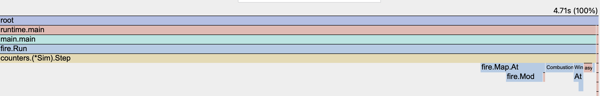

# Rapport d'audit de performance — Simulation d'incendie

> **Équipe :** … — **Session :** E42 — **Dépôt :** … (commit final : `…`)
>
> Consigne de rédaction : chaque affirmation chiffrée renvoie à un fichier de `results/`.
> Rédiger chaque section **juste après** la mesure correspondante, jamais à la fin.
>
> Les règles du modèle simulé sont spécifiées dans `internal/fire/REGLES.md` ; les renvois `§n`
> ci-dessous pointent vers ses sections. Les défauts volontaires de la baseline sont numérotés
> `[F1]`–`[F7]` en tête de `internal/naive/naive.go`.

## Résumé exécutif

Trois phrases : point de départ (débit baseline en cases/s), point d'arrivée, facteur de gain global
et les deux leviers principaux.

---

## 1. Environnement & métrologie (baseline) — /3

### 1.1 Banc d'essai matériel

Source : `results/<commit>/<banc>/env.md`, généré par `make env` au début de chaque campagne.

**Deux bancs, deux rôles distincts.** Chaque étape d'optimisation est mesurée sur les deux
machines, pour répondre à une question que le barème ne pose pas mais qu'un ingénieur se pose :
*le gain tient-il quand l'architecture change ?*

| Banc                                    | Rôle          | Ce qu'on en tire                                                           |
|-----------------------------------------|---------------|----------------------------------------------------------------------------|
| **A — MacBook Air M1** (ARM)            | **référence** | Tous les chiffres cités dans ce rapport, sauf mention contraire explicite. |
| **B — Intel Core Ultra 9 / WSL2** (x86) | contrôle      | Uniquement le *ratio* de gain de chaque étape, comparé à celui du banc A.  |

Règle appliquée sans exception : **aucun tableau ne mélange les deux bancs**, et aucune valeur
absolue du banc B n'est citée comme résultat. Comparer 2,1 s sur M1 à 0,8 s sur x86 n'apprend rien ;
comparer un gain de ×4,1 à un gain de ×3,8 apprend que l'optimisation est portable.

#### Banc A — référence

Source du relevé M1 : [env.md](../results/dcc3622/m1-air/env.md), campagne du 23 septembre 2026.
Les valeurs de cache sont celles exposées par sysctl, sans description exhaustive de la topologie.

| Élément                   | Valeur                                                                             |
|---------------------------|------------------------------------------------------------------------------------|
| CPU (modèle)              | Apple M1                                                                           |
| Cœurs physiques / threads | 8 / 8 — **4 performance + 4 efficiency**, pas de SMT                               |
| L1i / L1d (par cœur)      | 128 Kio / 64 Kio                                                                   |
| L2                        | 4 Mio                                                                              |
| L3                        | pas de L3 classique — *à préciser (System Level Cache)*                            |
| Ligne de cache            | **128 o**                                                                          |
| RAM                       | 8 Gio unifiée                                                                      |
| OS                        | macOS 15.5 (build 24F74)                                                           |
| Runtime                   | Go 1.27.1, darwin/arm64, CGO_ENABLED=1, GOGC=100 ; variable GOMAXPROCS non définie |
| SIMD disponibles          | NEON 128 bits (pas d'AVX : architecture ARM)                                       |
| Alimentation              | **Sur secteur**, mode économie d’énergie désactivé (déclaré par Cherif)            |

**Quatre réserves à porter au crédit de la métrologie, pas à sa charge :**

1. **Cœurs hétérogènes.** Le M1 mêle 4 cœurs *performance* et 4 cœurs *efficiency*. Conséquence
   directe pour le §3.2 : un worker pool dimensionné à `GOMAXPROCS` (8) répartit le travail sur des
   cœurs de puissances très inégales, et la bande la plus lente impose son rythme à la barrière de
   synchronisation. Attendre une scalabilité sous-linéaire dès que le nombre de workers dépasse 4,
   et dimensionner le pool aux cœurs *performance*.
2. **Ligne de cache de 128 octets**, le double du x86. Le *false sharing* du §4 se joue donc sur des
   zones deux fois plus larges, et le découpage en bandes du worker pool doit aligner ses frontières
   sur 128 o — une bande dont le bord partage une ligne avec la bande voisine invalide le cache des
   deux cœurs à chaque écriture.
3. **`perf` n'existe pas sur macOS.** Pas de compteur matériel `cache-misses` en ligne de commande.
   Les preuves du §2 reposent donc sur pprof (CPU et allocations) et, si un compteur matériel
   devient nécessaire, sur Instruments. À dire explicitement plutôt qu'à passer sous silence.
4. **Fréquence non verrouillée, et châssis sans ventilateur.** Apple Silicon ne laisse ni piloter le
   gouverneur ni figer le turbo, et le MacBook Air est refroidi passivement. Sur une charge de ~6,4 s
   répétée dix-huit fois, la machine chauffe et se bride de façon irrégulière : **le CV du banc A est
   de 3,1 %, contre 0,7 % sur le banc B** (§1.3). C'est la réserve la plus gênante de ce banc,
   puisque c'est lui qui fait foi — voir le §1.2 pour ce qu'on en déduit.

#### Banc B — contrôle de portabilité

| Élément                   | Valeur                                                                                             |
|---------------------------|----------------------------------------------------------------------------------------------------|
| CPU (modèle)              | Intel Core Ultra 9 275HX (Arrow Lake-HX), base 2,7 GHz                                             |
| Cœurs physiques / threads | 24 / 24 — **pas de SMT** : 1 thread par cœur                                                       |
| L1d / L1i (par cœur)      | 48 Kio / 64 Kio                                                                                    |
| L2                        | 3 Mio privés par cœur — **40 Mio au total** côté hôte                                              |
| L3                        | 36 Mio partagés par les 24 cœurs                                                                   |
| Ligne de cache            | 64 o                                                                                               |
| RAM                       | 64 Gio DDR5-6400 — **31 Gio visibles depuis WSL2**                                                 |
| OS / noyau                | Windows 11 Famille 10.0.26200 → **WSL2** Ubuntu 26.04 LTS, noyau 6.6.114.1-microsoft-standard-WSL2 |
| Runtime                   | go1.27.1 linux/amd64, `GOAMD64=v1`, `CGO_ENABLED=0`, `GOGC=100`, `GOMAXPROCS=24`                   |
| SIMD disponibles          | sse4_2, avx, avx2 (pas d'AVX-512 sur Arrow Lake)                                                   |

Source : [env.md](../results/dcc3622/x86-controle/env.md). Trois réserves, qui expliquent pourquoi ce
banc ne fournit que des ratios :

1. **Virtualisation Hyper-V.** Les mesures tournent dans WSL2, pas sur le métal. Le coût est
   constant entre les versions comparées — les ratios restent valides, les valeurs absolues sont
   minorées.
2. **Topologie hybride masquée.** L'Arrow Lake-HX mêle P-cores et E-cores, mais WSL2 présente 24
   cœurs homogènes (`lscpu` annonce même 72 Mio de L2, contre 40 Mio relevés côté hôte). Même
   conséquence qu'au banc A pour le §3.2, en pire : on ne sait même pas où sont les P-cores.
3. **Fréquence non verrouillée**, ni gouverneur ni turbo pilotables depuis WSL2.

### 1.2 Protocole de mesure

- Outil : Hyperfine `-N --warmup 3 --runs 15`, binaire exécuté sans shell intermédiaire.
- Justification du warmup : cache disque du binaire, caches CPU, stabilisation de la fréquence.
- Charge de travail : carte 1024×1024, graine 42, 64 foyers, `TURNS` tours. **Identique pour toutes
  les versions et pour les deux bancs** — elle est dimensionnée pour la plus petite des deux
  machines (8 Gio sur le banc A), ce qui exclut de promouvoir en charge officielle une carte au-delà
  de 4096².
- Une campagne = `make bench BANC=<nom>`, qui écrit dans `results/<commit>/<banc>/`. Le commit retenu
  n'est pas `HEAD` mais **le dernier ayant touché le code ou le protocole** (`internal`, `cmd`,
  `go.mod`, `Makefile`, `scripts`) : un commit qui n'ajoute que des résultats ou du rapport ne
  déplace pas la référence, si bien que les deux machines rangent leurs mesures au même endroit sans
  avoir à se synchroniser sur un hash. `env.md` porte les deux, `HEAD` et le code mesuré.
- Le pipeline **refuse de mesurer sur un arbre de travail modifié** : un dossier de résultats doit
  toujours correspondre exactement au code qu'il nomme.

> Les deux campagnes de référence ci-dessous partagent le dossier `results/dcc3622/`, mesuré sur les
> deux bancs le même jour : `m1-air` et `x86-controle`.
- Isolation du bruit : navigateur/IDE fermés, machine sur secteur, charge système vérifiée avant
  chaque campagne (voir `env.md`), [pinning si utilisé].

**La dispersion du banc de référence est sa faiblesse, et passer sur secteur ne l'a pas corrigée.**
Une première campagne M1 sur batterie donnait un CV de 1,7 % ; la même sur secteur donne **3,1 %**,
au-dessus du seuil de 2 % qu'on s'était fixé — le refroidissement passif du MacBook Air le bride
d'autant plus qu'il monte plus haut en fréquence (§1.1, réserve 4). Ce qu'on en tire :

- une moyenne sur 15 exécutions a une erreur standard de 3,1 % / √15 ≈ **0,8 %**, ce qui reste très
  inférieur aux gains attendus (plusieurs dizaines de pour cent) : les comparaisons d'étapes restent
  exploitables ;
- en revanche, **aucun écart inférieur à ~3 % ne sera déclaré significatif sur ce banc**, et les
  micro-benchmarks `go test -count 10` comparés par benchstat, qui donnent une p-value, primeront sur
  la ligne Hyperfine pour trancher les cas serrés ;
- piste d'amélioration si un cas serré se présente : augmenter `RUNS`, ou intercaler un temps de
  repos entre les exécutions (`hyperfine --prepare 'sleep 2'`) pour laisser le châssis refroidir.
- Micro-benchmarks : `go test -bench -benchmem -count 10`, comparés avec benchstat (intervalle de
  confiance, test de significativité).

**Un Step isolé ne se mesure qu'en régime établi.** `go test` choisit lui-même son nombre
d'itérations ; or en scénario `front` l'incendie s'étend pendant la mesure, donc le coût moyen d'un
tour dépend de ce nombre. Première campagne à l'appui : `Step/front/size=2048` donnait **±33 %** de
variance, inexploitable pour comparer deux implémentations, quand `Run` — qui borne le travail par
itération — tenait ±2 %. `BenchmarkStep` ne mesure donc que le régime saturé, et le scénario `front`
est mesuré par `BenchmarkRun`.

**Deux périmètres de mesure, à ne pas confondre — et c'est ce qui a fixé la charge.** La carte est
engendrée par `fire.Generate` **avant** la boucle de tours : les micro-benchmarks l'excluent de leur
chronomètre, mais Hyperfine mesure le processus entier, génération comprise. Sur une charge trop
courte, la génération domine le temps total et **écrase le gain à mesurer**.

Mesuré sur le banc B, carte 1024², 64 foyers :

| Charge        | Temps total | Dont simulation | Part de la génération |
|---------------|-------------|-----------------|-----------------------|
| 50 tours      | 0,84 s      | 0,178 s         | **79 %**              |
| **500 tours** | 8,15 s      | 7,49 s          | **8 %**               |

À 50 tours, une optimisation qui diviserait `Step` par deux n'aurait apparu que comme ~10 % sur la
ligne Hyperfine. **La charge est donc fixée à 500 tours**, ce qui ramène la génération sous 10 % du
temps mesuré.

Second argument, indépendant : le débit passe de 2,9 × 10⁸ à 7,0 × 10⁷ cases/s entre 50 et 500
tours. À 50 tours l'incendie n'a pas fini de s'étendre — on mesure un transitoire ; à 500 tours il
a atteint le régime entretenu décrit dans `REGLES.md` §4. Seule la seconde mesure est représentative
de ce que fait le programme.

### 1.3 Mesures de référence

#### Banc A — référence

Campagne sur le commit `dcc3622`, **machine sur secteur**, carte 1024², 64 foyers, 500 tours
demandés, avec 3 échauffements puis 15 exécutions Hyperfine.
Source : [statistiques](../results/dcc3622/m1-air/hyperfine-stats.md).

| Moyenne  | Médiane  | Écart-type | Variance   | CV        | Min      | Max      |
|----------|----------|------------|------------|-----------|----------|----------|
| 6,4229 s | 6,4606 s | 0,1968 s   | 0,03872 s² | **3,1 %** | 6,1872 s | 6,9199 s |

La dispersion dépasse le seuil de 2 %, et le passage sur secteur l'a **aggravée** : une première
campagne sur batterie, [conservée pour comparaison](../results/a47848f/m1-air/hyperfine-stats.md),
donnait 1,7 % (6,3767 s de moyenne). L'explication la plus probable est le refroidissement passif du
châssis (§1.1, réserve 4), qui bride la machine d'autant plus qu'elle monte plus haut en fréquence.
Le §1.2 précise ce qu'on en déduit : les comparaisons d'étapes restent exploitables, mais aucun écart
inférieur à ~3 % ne sera déclaré significatif sur cette seule ligne.

Le temps inclut le démarrage du processus et la génération de carte. Les micro-benchmarks `Run`
restent fixés à 50 tours ; leurs temps ne sont pas directement comparables à cette mesure globale.

#### Banc B — contrôle

Campagne de référence, commit `dcc3622`, carte 1024², 64 foyers, 500 tours, Hyperfine `-N --warmup 3
--runs 15` (`results/dcc3622/x86-controle/`) :

| Moyenne  | Médiane  | Écart-type | Variance        | CV        | Min      | Max      |
|----------|----------|------------|-----------------|-----------|----------|----------|
| 8,4021 s | 8,4104 s | 0,0611 s   | 3,729 × 10⁻³ s² | **0,7 %** | 8,2926 s | 8,4825 s |

Coefficient de variation à 0,7 %, bien sous le seuil de 2 % : la mesure est stable malgré une
fréquence non verrouillée et la virtualisation WSL2 — c'est le warmup et le nombre de runs qui
l'assurent. Fait notable : **le banc de contrôle est quatre fois plus stable que le banc de
référence**, dont le châssis se bride (§1.1, réserve 4).
Ces valeurs absolues ne sont pas des résultats du rapport ; seuls les ratios de gain mesurés sur ce
banc seront cités, en regard de ceux du banc A.

---

## 2. Diagnostic matériel & profiling réel — /5

> **Captures : `rapport/figures/<banc>/<vue>-<implémentation>.png`.** Carte 1024 × 1024, 64 foyers,
> 500 tours demandés (`make profile BANC=<nom>`). **Aucune capture n'est retouchée** : ce sont les
> sorties brutes de pprof, et l'annotation tient dans la légende, qui nomme les zones à lire et les
> chiffre. Une campagne rejouée ne demande ainsi que la mise à jour du texte — d'autant que les
> pourcentages d'un profil ont une incertitude de plusieurs points d'une exécution à l'autre, à code
> identique.

### 2.1 Profil CPU de la baseline


*Figure 1 — **Banc A** (Apple M1, macOS), celui qui fait foi. `naive`, carte 1024², graine 42,
64 foyers, 500 tours, commit `dcc3622`, machine sur secteur. Profil :
`results/dcc3622/m1-air/profiles/naive-cpu.prof`, 5,34 s d'échantillons sur 6,16 s. Le calcul dans
Step domine le CPU ; les indices toriques Map.At → Mod, le comptage Burning et `runtime.madvise` —
le retour de mémoire au système — sont également visibles.*  
Sources : [profil CPU](../results/dcc3622/m1-air/profiles/naive-cpu-top.txt)
et [détail par ligne](../results/dcc3622/m1-air/profiles/naive-cpu-list.txt).

Chiffres correspondants :  

| Fonction | Part directe (flat) | Part appels inclus (cum) |
|----------|--------------------:|-------------------------:|
| Step     |             73,78 % |                  87,45 % |
| Burning  |              6,74 % |                   6,74 % |
| `runtime.madvise` |     5,43 % |                   5,43 % |
| Mod      |              5,24 % |                   5,24 % |
| Terrain.Combustion |    2,62 % |                   2,62 % |
| Map.At   |              2,43 % |                   7,30 % |

Le profil couvre 6,16 s, avec 5,34 s d'échantillons CPU. Les pourcentages
portent sur ces échantillons, pas sur le temps Hyperfine. Les coûts cumulés
s'incluent : Map.At et Mod sont notamment compris dans Step et ne doivent pas
être ajoutés à ses 87,45 %. Le profil CPU commence après la génération de carte.
Fingerprint n'est pas appelé par fire.Run et n'apparaît donc pas dans ce profil.

Deux observations propres à ce banc. **`Burning` y coûte plus cher que `Mod`** — 6,74 % contre
5,24 % : recompter toute la carte à chaque appel pèse davantage, ici, que l'enroulement torique.
Et `runtime.madvise`, à 5,43 %, est la trace des tampons jetés à chaque tour : le noyau rend la
mémoire au système puis la redemande. C'est un coût CPU imputable aux allocations, que le seul
`gcBgMarkWorker` du profil x86 ne laissait pas voir.

#### Observation complémentaire — banc B (x86, hors référence M1)


*Figure 2 — **Banc B** (Intel Core Ultra 9 275HX, WSL2), contrôle de portabilité. Même code et même
charge que la figure 1. Profil : `results/dcc3622/x86-controle/profiles/naive-cpu.prof`, 7,94 s
d'échantillons sur 7,71 s. Deux zones à lire :*
- *le large bloc central `fire.Map.At → fire.Mod`, directement sous Step : **3,31 s, soit 42 % du
  CPU** — c'est `naive.go:104`, deux divisions entières par voisin et huit voisins par case en feu ;*
- *la pile de droite `fire.Map.WindAt → fire.Map.At → fire.Mod` : **0,82 s, 10 % du CPU**, alors
  qu'1 % seulement des cases portent du vent — c'est `naive.go:97`, où WindAt refait lui-même un
  Map.At pour découvrir presque toujours qu'il n'y a pas de vent.*

*Ni l'une ni l'autre n'a d'équivalent sur la figure 1 : Mod y pèse 5,2 % contre 41,1 % ici.*  
Source : [profil CPU x86](../results/dcc3622/x86-controle/profiles/naive-cpu-top.txt).
Ce profil couvre 7,71 s et totalise 7,94 s d'échantillons CPU.

| Fonction               | CPU direct | CPU cumulé |
|------------------------|-----------:|-----------:|
| Step                   |    46,22 % |    94,84 % |
| Mod                    |    41,06 % |    41,18 % |
| Map.At                 |     2,52 % |    43,70 % |
| Map.WindAt             |     3,78 % |    10,33 % |
| Burning                |     2,27 % |     2,27 % |
| runtime.gcBgMarkWorker |        0 % |     2,35 % |

Le modulo apparaît proportionnellement plus coûteux sur ce profil x86 que sur
M1. Cette observation motive une vérification de portabilité, sans établir
à elle seule la cause matérielle. Les 2,35 % de gcBgMarkWorker ne représentent
pas tout le coût des allocations ou du GC : ils ne prouvent pas que supprimer
le tampon alloué par tour serait sans effet sur le temps CPU.
Fingerprint est absent des deux profils car fire.Run ne l'appelle pas.

### 2.2 Profil d'allocations


*Figure 3 — **Banc A** (Apple M1, macOS). Même exécution que la figure 1, commit `dcc3622`. Profil :
`results/dcc3622/m1-air/profiles/naive-mem.prof`, échantillonné à `MemProfileRate = 4096` octets.
Sur cette exécution, le tampon d'allumage créé par Step domine les allocations ; la génération
initiale de la carte contribue également au volume total.*  
Source : [profil alloc_space](../results/dcc3622/m1-air/profiles/naive-mem-top.txt).

Le volume cumulé estimé est de 595,28 MB dans les unités affichées par pprof :
Step représente 82,15 % et Generate, appels inclus, 17,33 %.
Il ne s'agit ni du pic de mémoire ni de la mémoire conservée en fin d'exécution.
Contrairement au profil CPU, le profil cumulatif d'allocations inclut la génération
initiale. Les estimations échantillonnées ne remplacent pas les mesures par opération.

Les [micro-benchmarks](../results/dcc3622/m1-air/benchstat.txt) mesurent
1 allocation de 1 Mio par Step à 1024². Le benchmark isolé de Fingerprint
mesure environ 451 200 allocations et 16,82 Mio par appel ; cette opération
ne fait pas partie de l'exécution normale profilée ici.

Une mesure spécifique des
pauses et du temps GC reste à effectuer ; elle ne se déduit pas du volume alloué.

#### Observation complémentaire — allocations du banc B


*Figure 4 — **Banc B** (Intel Core Ultra 9 275HX, WSL2). Même code, même charge, même commit que la
figure 3. Profil : `results/dcc3622/x86-controle/profiles/naive-mem.prof`. La figure est
superposable à la figure 3 : c'est le résultat à retenir, et il se vérifie ici plutôt que de
s'affirmer.*  
Source : [profil alloc_space x86](../results/dcc3622/x86-controle/profiles/naive-mem-top.txt).

Mise en regard des deux bancs :

|                           |         Banc A (M1) |        Banc B (x86) |
|---------------------------|--------------------:|--------------------:|
| Total estimé              |           595,34 MB |           596,38 MB |
| `Step`                    |    489 MB — 82,14 % |    491 MB — 82,33 % |
| `Generate`, appels inclus | 103,14 MB — 17,32 % | 102,22 MB — 17,14 % |
| `champLisse`              |      32 MB — 5,38 % |      32 MB — 5,37 % |
| `quantile`                |   31,05 MB — 5,21 % |   31,05 MB — 5,21 % |

**Les deux profils coïncident à 0,2 point près**, écart imputable à l'échantillonnage de pprof. C'est
la vérification du principe utilisé ailleurs dans ce rapport : **le volume alloué est une propriété
du code, pas de la machine**, et un compte d'allocations mesuré sur un banc vaut pour l'autre.

Le contraste avec le §2.1 en est d'autant plus instructif : *le même volume alloué* se paie
différemment selon le système — `runtime.madvise` à 5,43 % du CPU sur macOS, `gcBgMarkWorker` à
2,35 % sur Linux. Volume identique, coût CPU différent : ces deux profils ne mesurent pas la même
chose, et seul celui du CPU dit ce que les allocations coûtent réellement.

Ces estimations cumulées ne sont pas un comptage exact des 500 tampons ; le micro-benchmark confirme
séparément 1 Mio par `Step`. `Generate` est hors chronométrage des micro-benchmarks de simulation,
mais fait partie du processus mesuré par Hyperfine.

### 2.3 Identification formelle du hot path

1. **Step : 90,48 % du CPU, appels inclus.** La propagation puis les transitions
   balayent la grille. Map.At et Mod contribuent au calcul des positions toriques.
   Source : profil CPU ci-dessus et `internal/naive/naive.go`.
2. **Tampon d'allumage : 1 Mio alloué par tour en 1024².** Step construit un
   nouveau tableau booléen à chaque appel. Le réutiliser est une hypothèse
   mesurable de réduction des allocations, pas encore une preuve de gain CPU.
3. **Burning : 6,74 % du CPU**, soit davantage que le modulo torique sur ce banc. Le nombre de cases
   en feu est recalculé par un balayage complet à chaque appel.
4. **Fingerprint : coût isolé, hors du chemin de fire.Run.** Sur le banc M1,
   sa médiane est de 24,05 ms contre 10,03 ms pour Step dans le scénario
   embrasement, soit environ 2,40 fois. Ces benchmarks utilisent des états et
   protocoles différents (empreinte sur état fixe, Step sur état évolutif) :
   ce ratio n'est pas une part du temps de simulation. Le formatage des coordonnées
   explique ses nombreuses allocations, mais son optimisation seule n'accélérera
   pas fire.Run tant que celui-ci ne l'appelle pas.

Sources des micro-mesures : [benchstat](../results/dcc3622/m1-air/benchstat.txt)
et [résultats bruts](../results/dcc3622/m1-air/bench.txt). Les comptes d'allocations
sont ceux mesurés sur M1 ; leur égalité sur un autre environnement doit être vérifiée.

#### Le même filtre sur les deux bancs

Les deux captures suivantes sont les mêmes vues que les figures 1 et 2, avec `Mod` saisi dans le
champ *Search regexp* de pprof : l'outil encadre lui-même les cadres correspondants, sans retouche
d'image, et le champ reste visible dans la capture — n'importe qui peut la reproduire.

  
*Figure 5 — **Banc A** (M1). Le cadre `fire.Mod` encadré occupe environ 5 % de la largeur du
graphe ; `Burning`, à sa droite, est visiblement plus large — il coûte effectivement plus cher
(6,74 % contre 5,24 %).*


*Figure 6 — **Banc B** (x86). Même filtre, même code, même charge, même commit : le cadre `fire.Mod`
occupe environ 35 % de la largeur, soit sept fois plus qu'à la figure 5 (41,1 % du CPU contre 5,2 %).*

**C'est le résultat central du diagnostic**, et il n'aurait pas été visible avec un seul banc : la
division entière du modulo torique domine le profil x86 et reste marginale sur ARM. Une optimisation
qui la supprime doit donc être attendue comme un gain majeur sur le banc B et modeste sur le banc A
— hypothèse à vérifier par la mesure, l'écart de coût d'instruction entre les deux jeux
d'instructions n'étant pas établi par ces seuls profils.

#### Pistes de portabilité issues du diagnostic x86
Le [profil par ligne x86](../results/dcc3622/x86-controle/profiles/naive-cpu-list.txt)
met en évidence le calcul des cibles via Map.At, la lecture du vent via WindAt
et le calcul du secteur amont. WindAt est interrogé pour chaque case en feu,
même si elle ne porte pas de vent ; il recalcule des indices toriques.

Les pistes à comparer sur les deux bancs sont :

- Enroulement torique : masque pour les dimensions en puissance de deux,
  traitement général pour les autres dimensions.
- Lecture du vent par indice direct, sans recalcul de coordonnées valides.
- Réutilisation du tampon et stockage contigu, pour mesurer le gain réel en
  allocations et en temps, sans l'inférer du seul profil GC.
- Liste de cases actives, à valider selon la densité de feu.
- Empreinte sans formatage, pour ses usages propres ; elle n'accélère pas
  l'exécution actuelle de fire.Run.

Pour mémoire, les valeurs correspondantes du banc B sur la campagne courante
(son [benchstat](../results/dcc3622/x86-controle/benchstat.txt)) : 12,81 ms ± 1 %
pour Step/embrasement/1024 et 20,60 ms ± 4 % pour Fingerprint/1024, soit un rapport
de 1,61 contre 2,40 sur M1. Ces données restent un diagnostic du banc B, pas la référence.

### 2.4 Deux pièges de lecture, à écarter avant d'interpréter

Ces deux observations ont été faites au cours de la mise au point, sur une autre machine que le banc
retenu : **elles sont méthodologiques, à reproduire ici avant d'être citées comme résultat.**

1. **Le débit en cases/s augmente avec la taille de la carte**, à nombre de foyers constant. Ce
   n'est pas une amélioration : plus la carte est grande, plus la fraction qui brûle est petite, et
   le débit compte des cases *balayées*, pas du travail utile. Pour comparer deux tailles, il faut
   garder la **densité de feu** constante — foyers proportionnels à la surface.
2. **Brider la machine ne change pas les ratios.** Réduire le nombre de cœurs, rendre le GC agressif
   ou contraindre la RAM laisse le temps d'exécution inchangé : la baseline est mono-thread et
   n'alloue qu'une fois par tour. Seule la contention CPU la ralentit, et linéairement. Corollaire
   utile : une machine plus lente ne fait pas apparaître un gain qui n'existe pas — c'est la
   mesure normalisée (cycles par case) qui démasque une implémentation coûteuse, pas le chronomètre.

**Dispersion, et elle n'est pas où on l'attendrait.** Sur la campagne `dcc3622`, les
micro-benchmarks du banc B affichent ±12 % pour Run/front/512 et **±18 %** pour Run/front/1024,
quand les mêmes mesures sur le banc A tiennent ±1 %. C'est l'inverse d'Hyperfine, où le banc A est
le moins stable (CV 3,1 % contre 0,7 %) : les micro-benchmarks sont assez courts pour échapper au
bridage thermique du MacBook Air, tandis que le scénario `front` a peu d'itérations et subit les
allocations. Les allocations et le GC restent des hypothèses d'explication ; une attribution causale
exigerait des mesures complémentaires. Aucun seuil universel de gain ne peut en être déduit : la
significativité sera évaluée sur les échantillons comparés, banc par banc.

**Un benchmark peut mesurer autre chose que ce qu'il annonce.** `BenchmarkRun` reconstruit le moteur
à chaque itération, quand le binaire ne le construit qu'une fois. Pour une implémentation qui alloue
un millier de blocs à la construction, cette répétition domine la mesure : `BenchmarkRun/front/1024`
annonçait un gain de **×3,4** pour `flat` là où le programme réel en donne **×1,12** (§3.1). Deux
enseignements pour la suite :

- **confronter tout gain spectaculaire d'un micro-benchmark au binaire complet** avant de l'écrire —
  ici un simple `hyperfine` sur `./bin/wildfire` a suffi à ramener le facteur de 3,4 à 1,12 ;
- se méfier des mesures dont le **coût d'installation** est du même ordre que le travail mesuré. Le
  scénario `front` à 50 tours coûte ~110 ms quand construire `naive` en coûte 0,32 — sauf sous
  pression du ramasse-miettes, où la facture devient tout autre.

C'est ce qui a fait écarter `BenchmarkStep` en scénario front (§1.2) ; `BenchmarkRun` souffre du même
travers sous une autre forme, et l'a caché plus longtemps parce que sa variance restait basse.

---

## 3. Journal d'optimisation — /5

Une entrée par étape, toujours au même format :

> **Étape N — titre** (commit `…`)
> - **Hypothèse d'impact matériel :** …
> - **Modification :** …
> - **Commande de vérification :** `…`
> - **Résultat (banc A, référence) :** avant → après (benchstat, avec p-value) ; allocs/op avant → après.
> - **Résultat (banc B, contrôle) :** le gain seul, en ratio.
> - **Portabilité :** l'écart entre les deux gains, et son explication. Un gain qui s'effondre d'un
>   banc à l'autre désigne une propriété matérielle précise — taille de cache, ligne de 64 contre
>   128 octets, nombre de cœurs réels, jeu d'instructions.
> - **Explication physique :** …

Chaque étape est un **package distinct**, enregistré dans le registre de `internal/fire` et ajouté à
`internal/engines` : la suite de conformité `internal/firetest` la rejoue automatiquement, et une
version qui casse une règle est rejetée avant d'être mesurée.

### Étape 1 — `flat` : stockage contigu et tampons réutilisés

**Nature : mixte, selon les définitions du cours.** Macro : remplacement de
`[][]Cell` par deux grilles contiguës `[]Cell`, modification de la structure des
données. Micro : suppression du tampon d'allumage temporaire, désormais alloué
une fois et réinitialisé avec `clear` à chaque tour.

**Hypothèse :** passer de 1 allocation de 1 Mio par Step à 0 allocation et
0 octet par tour sur 1024². Cette hypothèse porte sur les allocations ;
le gain CPU éventuel doit être établi séparément.

**Implémentation :** la propagation lit la grille courante et marque un tampon
`[]bool`. Les transitions écrivent toutes les cellules dans la seconde grille,
puis les deux grilles sont échangées. Réécrire chaque cellule et remettre les
marques à zéro évite les états périmés. Le double tampon suit le plan convenu,
mais n'est pas indispensable à la synchronisation de cette baseline déjà en
deux phases ; son coût en mémoire et en écritures doit donc être évalué.

**Complexité :** O(N) par Step et O(N) en mémoire avant et après, N étant le
nombre de cases et le nombre de voisins étant borné. Burning reste un balayage
O(N). Avec Cell de 2 octets, les deux grilles et le tampon représentent 5N octets
de données persistantes (5 Mio en 1024²), hors carte et en-têtes. Ce changement
réduit le volume alloué par tour, pas nécessairement la mémoire résidente.

**Périmètre contrôlé :** règles, modulos, lecture du vent, recomptage Burning
et formatage/SHA-256 de Fingerprint sont conservés. Le maintien du formatage et
des modulos est une exception expérimentale aux interdits de constitution.md
pour isoler cette étape. New et Fingerprint allouent toujours.
La baseline naive et la référence firetest restent intactes.

**Validation réalisée :** `go test ./... -count=1` passe. La suite commune est
complétée par une comparaison cellule par cellule et des empreintes sur 100 tours
avec vent et dimensions impaires, un test d'extinction sans contagion résiduelle,
et un test `AllocsPerRun` qui vérifie zéro allocation par Step sur 67 × 45.
L'analyse `go build -gcflags=-m ./internal/flat` documente les allocations du
constructeur et de l'empreinte ; Step ne contient pas d'allocation de tampon.

**Commande de campagne exécutée sur le banc M1, commit de code `1d3a093` :**

```bash
make bench BANC=m1-air
```

Cette campagne intègre les ajouts de snapshots après fusion de main. Les
benchmarks de snapshots constituent une série I/O distincte, sans clé `impl` :
leur colonne non nommée dans benchstat ne représente pas un troisième moteur.
Les moyennes géométriques de séries différentes ne servent pas à conclure sur flat.

**Résultats banc A — Apple M1.** Sources :
[benchstat](../results/1d3a093/m1-air/benchstat.txt),
[mesures brutes](../results/1d3a093/m1-air/bench.txt) et
[tests](../results/1d3a093/m1-air/tests.txt).

| Mesure | naive | flat | Conclusion |
|---|---:|---:|---|
| Allocations par Step, 1024² | 1 | 0 | Objectif atteint |
| Octets alloués par Step, 1024² | 1 Mio | 0 | Tampon temporaire supprimé |
| Temps médian Step/embrasement, 1024² | 9,962 ms | 9,932 ms | Pas de différence significative, p = 0,218 |
| Temps médian Step/embrasement, 2048² | 23,67 ms | 23,89 ms | flat environ 0,9 % plus lent, p = 0,019 |

Sur BenchmarkRun en 1024², le volume cumulé alloué passe de 52,03 Mio à
5 Mio, soit environ 90,4 % de réduction ; les allocations passent de 1 076
à 4 par exécution, construction du moteur comprise. Il ne s'agit pas du pic de
mémoire occupée. Step n'alloue plus pour les trois tailles testées.

Les résultats CPU sont mixtes : Step en 256² et Run/front en 512² s'améliorent,
mais Run/front en 1024² et Fingerprint présentent de petites régressions
significatives. Run/embrasement ne montre pas de différence significative,
ni en 512² (p = 0,912), ni en 1024² (p = 0,165).
Benchstat prend flat comme référence : un pourcentage négatif dans la colonne
naive indique que naive est plus rapide. Les p-values affichées `0.000` sont
arrondies, pas nulles.

**Temps global — 500 tours demandés.** Source :
[statistiques Hyperfine](../results/1d3a093/m1-air/hyperfine-stats.md).

| Moteur | Temps moyen | Écart-type | CV |
|---|---:|---:|---:|
| naive | 6,4270 s | 0,1623 s | 2,5 % |
| flat | 6,3312 s | 0,0302 s | 0,5 % |

La diminution observée de la moyenne est d'environ 1,5 %. Ce rapport de
moyennes ne suffit pas à établir un gain global statistiquement significatif.
Hyperfine inclut la génération de carte et l'exécution du processus ; les
micro-benchmarks Run de cette version ne calculent que 50 tours maximum.

**Interprétation mémoire–CPU.** La réduction des allocations est démontrée,
mais elle ne produit pas une accélération systématique. Le double tampon ajoute
une grille persistante de 2 Mio en 1024² et modifie les accès mémoire. Son rôle
dans les régressions est une hypothèse à tester avec une variante sans second
tampon de cellules ; aucun profil matériel ne prouve ici la cause des écarts.

**Banc B — contrôle de portabilité.** Mesures x86 sur le même commit de code
`1d3a093` ([benchstat](../results/1d3a093/x86-controle/benchstat.txt)) :

| Mesure (1024²) | naive | flat | Écart |
|---|---:|---:|---:|
| `Run` scénario front | 388,2 ms ± 17 % | **115,5 ms ± 1 %** | flat ×3,4 |
| `Run` scénario embrasement | 204,5 ms | 183,3 ms | flat +11,6 % |
| `Step` embrasement (état chauffé) | 12,75 ms | 12,55 ms | flat +1,6 % |
| Hyperfine, 500 tours | 8,4190 s | 8,3960 s | flat +0,3 % |

Sur le banc A, la même mesure `Run` front donne 160,6 ms contre 161,1 ms : **aucun
écart**. La même optimisation, le même benchmark, et un facteur 3,4 d'un banc à
l'autre.

> ⚠ **Le ×3,4 de la première ligne est un artefact de mesure, pas un gain.** Il
> est conservé ici parce que c'est ce que le benchmark rapporte, mais la suite de
> cette section établit qu'il ne décrit pas le comportement du programme. Le gain
> réel en scénario front est de **×1,12**.

**Une hypothèse posée puis réfutée.** L'échelonnement des gains — ×3,4 sur 50
tours, +1,6 % sur un tour isolé, +0,3 % sur 500 tours — évoquait un coût fixe
payé une seule fois, soit la construction du moteur : `naive` y fait 1026
allocations, `flat` 4. `BenchmarkNew` a été écrit pour le vérifier et a réfuté
l'hypothèse : construire coûte **0,32 ms à naive et 0,37 ms à flat** en 1024²,
quand l'écart à expliquer est de **273 ms**. `flat` est même *plus lent* à
construire, allouant 5,2 Mio contre 2,1 Mio.

**Ce que les chiffres imposent donc.** L'écart est bien par tour, et il dépend de
la **densité de feu** : massif quand peu de cases brûlent (scénario front),
négligeable sur une carte saturée (`Step` sur état chauffé, +1,6 %). Les mesures
intermédiaires s'alignent sur cette lecture — `Run` embrasement part de 64 foyers
et ne sature qu'en cours de route, d'où ses +11,6 % ; Hyperfine mesure 500 tours
en régime saturé, d'où ses +0,3 %.

**Le profil a ensuite montré que la lecture ci-dessus était elle-même fausse.**
Profils produits sur le banc B, commit `1d3a093`
([naive](../results/1d3a093/x86-controle/profiles/naive-front50-cpu-top.txt),
[flat](../results/1d3a093/x86-controle/profiles/flat-front50-cpu-top.txt)), dans
les conditions exactes du benchmark — un foyer, 50 tours — sur une carte 4096²
pour que la durée soit exploitable par l'échantillonneur :

| | naive | flat |
|---|---:|---:|
| Total échantillonné | **1,71 s** | **1,94 s** |
| `Step` | 1,27 s | 1,33 s |
| `Burning` | 0,40 s | 0,54 s |
| `fire.Mod` | absent du profil | absent du profil |

`flat` y est **plus lent que `naive`**, et `fire.Mod` n'apparaît dans aucun des
deux : avec un seul foyer, presque aucune case ne brûle, donc presque aucune
propagation. Le temps est intégralement dans le balayage d'application et dans
`Burning`.

**D'où vient alors le ×3,4 ?** De `BenchmarkRun` lui-même, qui **reconstruit le
moteur à chaque itération** — `naive` y refait 1076 allocations que le ramasse-
miettes doit ensuite tracer pendant que la simulation continue d'allouer. Le
binaire, lui, ne construit qu'une fois. Mesuré au CLI dans les mêmes conditions
(1024², un foyer, 50 tours, Hyperfine `-N --warmup 3 --runs 12`) :

| | naive | flat | Écart |
|---|---:|---:|---:|
| Processus complet | 900,3 ms ± 101,8 ms | 801,7 ms ± 8,9 ms | **×1,12** |
| Écart-type | 101,8 ms | **8,9 ms** | ÷11 |

`flat` mesuré au CLI (801,7 ms) et au benchmark (115,5 ms + génération) coïncide ;
`naive` est **2,7 fois plus lent au benchmark qu'au CLI**. L'écart est donc
entièrement imputable à la reconstruction répétée, que seul le benchmark impose.

**Et l'artefact est propre au banc B.** La même mesure sur le banc A
([hyperfine](../results/1d3a093/m1-air/profiles/front50-hyperfine.md)) :

| CLI, 1024², un foyer, 50 tours | naive | flat | Rapport |
|---|---:|---:|---:|
| Banc A (M1) | 641,6 ± 9,2 ms | 639,6 ± 7,0 ms | **1,00** |
| Banc B (x86) | 900,3 ± 101,8 ms | 801,7 ± 8,9 ms | 1,12 |

Sur le banc A, le benchmark et le binaire concordent — aucun écart des deux côtés,
et une dispersion faible pour les deux moteurs. Reconstruire un millier de petits
blocs n'y coûte donc rien de mesurable, là où cela suffit sur le banc B à faire
apparaître un gain de ×3,4 qui n'existe pas. **Un même benchmark peut donc être
fidèle sur une machine et trompeur sur une autre** : c'est un argument de plus
pour mesurer sur deux bancs, au-delà de la seule question de la portabilité des
gains.

`BenchmarkNew` n'avait pas suffi à le voir : il mesure la construction **isolée**,
en boucle serrée, où les objets sont recyclés immédiatement sans que le GC ait à
les tracer. C'est une mesure juste qui répond à la mauvaise question.

**Conclusion.** Le gain réel de `flat` est de **×1,12** sur le scénario front et
nul en régime saturé. Son apport principal n'est pas la vitesse mais la
**régularité** : l'écart-type passe de 101,8 ms à 8,9 ms, et le CV Hyperfine de
2,5 % à 0,5 % sur le banc A. Une baseline qui n'alloue plus rend le banc lui-même
plus fiable pour toutes les étapes suivantes — ce qui, vu la dispersion du banc de
référence (§1.1, réserve 4), vaut mieux qu'un gain de quelques pour cent.

#### Profils des deux bancs, et ce qu'ils désignent pour la suite

Profils produits sur les deux machines au commit `1d3a093`
([banc A](../results/1d3a093/m1-air/profiles/), [banc B](../results/1d3a093/x86-controle/profiles/)),
en deux régimes : le réglage par défaut de `make profile` (64 foyers, 500 tours, 1024²) et le
scénario front (un foyer, 50 tours, 4096²).

| Poste | A · naive | A · flat | B · naive | B · flat |
|---|---:|---:|---:|---:|
| **Régime saturé** | | | | |
| `Step` | 76,3 % | 79,5 % | 48,8 % | 36,8 % |
| `fire.Mod` | 9,2 % | 6,7 % | **37,2 %** | **40,9 %** |
| `Burning` | 3,3 % | 6,2 % | 2,8 % | 3,7 % |
| `runtime.madvise` | 1,4 % | **absent** | absent | absent |
| **Scénario front** | | | | |
| `Step` | 77,6 % | 73,3 % | 74,3 % | 68,6 % |
| **`Burning`** | **20,7 %** | **21,5 %** | **23,4 %** | **27,8 %** |
| `fire.Mod` | **absent** | **absent** | **absent** | **absent** |

Trois enseignements.

**`madvise` disparaît bien chez `flat`**, comme l'hypothèse le prévoyait — mais l'effet est plus
petit qu'annoncé au §2.1 : il y pesait 5,43 %, relevé sur une campagne faite *sur batterie*, contre
1,43 % ici sur secteur. Supprimer les allocations économise donc environ un point de CPU, pas cinq.

**`fire.Mod` disparaît des quatre profils en scénario front.** Avec un seul foyer, presque aucune
case ne brûle, donc presque aucune propagation : le modulo torique n'est appelé qu'à travers elle.
L'optimisation `ghost` ne rapportera donc rien dans ce régime, et tout dans l'autre — où elle vaut
37 à 41 % sur le banc B contre 7 à 9 % sur le banc A.

**`Burning` pèse 21 à 28 % du CPU en scénario front, sur les deux bancs et les deux
implémentations**, contre 3 à 6 % en régime saturé. Quand peu de cases brûlent, recompter la carte
entière à chaque appel devient le deuxième poste du programme, juste derrière `Step`. C'est le plus
gros gisement encore ouvert sur le banc de référence, et le moins coûteux à combler — un compteur
tenu à jour dans `Step` suffit. Cela confirme l'étape `counters` prévue, et la fait passer devant
`ghost` dans l'ordre des priorités.

> **Réserve de lecture.** Chaque profil est une exécution unique. Les *parts relatives* sont
> exploitables ; les totaux ne le sont pas — comparer 4,89 s à 5,37 s entre deux profils n'aurait
> pas de sens, ces durées incluant l'échantillonnage et variant d'une exécution à l'autre. Les
> comparaisons de temps viennent de benchstat et d'Hyperfine, pas d'ici.

### Étape 2 — `counters` : nombre de cases en feu maintenu incrémentalement

**Commit de code : `ae8b974`. Nature : macro-optimisation algorithmique.**
`Burning()` passe d'un balayage O(N) à une lecture O(1), N étant le nombre de
cases. `Step()` et un tour complet restent O(N). Cette étape part de `flat` ;
`naive` et `firetest` ne sont pas modifiés.

**Hypothèse d'impact matériel :** supprimer un parcours de la grille à chaque
appel de `Burning` réduit les lectures mémoire et le travail CPU. Les profils
précédents attribuent à ce parcours environ 21 % du CPU en front et 3–6 % en
saturé sur M1. À coût restant inchangé, les plafonds théoriques sur la portion
profilée sont donc ×1,27 et ×1,03–1,06. Ce ne sont pas des gains promis sur le
programme complet : la génération de carte reste à payer et la mise à jour du
compteur ajoute du travail à `Step`. Objectif mémoire : conserver 0 allocation/tour.

**Modification :** initialiser le compteur avec les foyers réellement allumés,
sans compter deux fois un foyer dupliqué ni compter l'eau ; incrémenter à
l'allumage et décrémenter à l'extinction dans la transition existante. Les
modulos, les tampons et le formatage de `Fingerprint` restent ceux de `flat`
pour isoler l'effet du compteur.

**Correction avant mesure :** `make test`, `make escape IMPL=counters` et
`make quick IMPL=counters` passent. Les tests comparent les états et le compteur
à `flat` sur 500 tours, ainsi que sur de petits tores, avec doublons et après
extinction. Le test d'allocations confirme zéro allocation par `Step`.
L'analyse d'échappement signale les allocations de construction, d'enregistrement
et de `Fingerprint`, conservées intentionnellement ; cette dernière méthode
n'est pas appelée par `fire.Run`. Aucun travail de padding dans cette étape.

**Sources banc A :** [environnement](../results/ae8b974/m1-air/env.md),
[tests](../results/ae8b974/m1-air/tests.txt),
[benchstat](../results/ae8b974/m1-air/benchstat.txt),
[mesures brutes](../results/ae8b974/m1-air/bench.txt).
La campagne identifie le code `ae8b974`, sans avertissement de modifications
non commitées : Apple M1, macOS 15.5, Go 1.27.1, darwin/arm64.

**Commandes de mesure** (code commité, banc M1 de référence) :

```bash
make bench BANC=m1-air
benchstat -col /impl results/ae8b974/m1-air/bench.txt
make profile IMPL=counters BANC=m1-air
make flame IMPL=counters BANC=m1-air
hyperfine -N --warmup 3 --runs 12 \
  --export-json results/ae8b974/m1-air/front50-hyperfine.json \
  --export-markdown results/ae8b974/m1-air/front50-hyperfine.md \
  -n "flat front" "./bin/wildfire -impl flat -size 1024 -turns 50 -fires 1 -quiet" \
  -n "counters front" "./bin/wildfire -impl counters -size 1024 -turns 50 -fires 1 -quiet"
```

**Résultat banc A — microbenchmarks, 10 échantillons par version.** Le fichier
benchstat place `counters` en première colonne : son « vs base » exprime donc
`flat` relativement à `counters`. Ici, les variations sont recalculées dans
le sens de l'optimisation, `(counters / flat - 1) × 100`, à partir des valeurs
arrondies ; une valeur négative signifie moins de temps.

| Mesure | `flat` | `counters` | Variation du temps | p-value |
|---|---:|---:|---:|---:|
| Step embrasement 256² | 767,1 µs | 780,9 µs | +1,8 % (régression) | < 0,001 |
| Step embrasement 1024² | 9,997 ms | 9,984 ms | pas de différence significative | 0,971 |
| Step embrasement 2048² | 24,00 ms | 23,91 ms | −0,4 % | 0,011 |
| Run front 512² | 40,33 ms | 30,86 ms | −23,5 % | < 0,001 |
| Run front 1024² | 160,7 ms | 122,1 ms | −24,0 % | < 0,001 |
| Run embrasement 512² | 64,80 ms | 56,15 ms | −13,3 % | < 0,001 |
| Run embrasement 1024² | 203,6 ms | 166,6 ms | −18,2 % | < 0,001 |

`Run` inclut la construction du moteur et 50 tours au maximum, mais exclut la
génération de carte. Il ne mesure donc pas le même périmètre que le binaire.
Aucun gain significatif de construction (`New`) face à `flat` aux trois tailles.
`Fingerprint`, non optimisé ici, reste à environ 24,5 ms et 451 200 allocations
par appel ; son faible écart mesuré ne constitue pas le mécanisme de cette étape.

**Mémoire :** `Step` conserve **0 B/op et 0 allocs/op** aux trois tailles.
`Run` conserve 4 allocations et environ 5 Mio en 1024², comme `flat` : cette
étape supprime des lectures de grille, pas un tampon. Le très faible supplément
de stockage du compteur ne change pas ces valeurs arrondies. Il ne faut pas
confondre octets alloués, mémoire résidente et trafic mémoire.

**Résultat banc A — programme complet, génération comprise.** Sources :
[Hyperfine 500 tours](../results/ae8b974/m1-air/hyperfine-stats.md) et
[Hyperfine front 50 tours](../results/ae8b974/m1-air/front50-hyperfine.md).

| Charge 1024² | Répétitions | `flat` (moyenne ± écart-type) | `counters` | Temps en moins | Accélération |
|---|---:|---:|---:|---:|---:|
| 64 foyers, 500 tours | 15 | 6,2987 ± 0,0211 s | 5,9433 ± 0,0364 s | 5,6 % | ×1,060 |
| 1 foyer, 50 tours | 12 | 645,3 ± 8,7 ms | 604,9 ± 8,3 ms | 6,3 % | ×1,067 |

En 500 tours, les CV sont de 0,3 % (`flat`) et 0,6 % (`counters`). En front,
ils sont d'environ 1,4 % ; Hyperfine signale des valeurs atypiques pour
`counters`, à conserver comme réserve. Ces résultats sont des gains observés
sur cette campagne ; aucune p-value n'est fournie par ce résumé Hyperfine.
La réduction de 24 % du microbenchmark Run/front ne doit donc pas être annoncée
comme gain global : le binaire complet gagne environ 6,3 %, la génération de
carte diluant l'effet. Sur 500 tours, `naive` prend 6,4003 s : le gain cumulé
observé de `counters` face à la baseline est ×1,077 (7,1 % de temps en moins).

**Profil CPU et explication physique.** Le
[profil CPU](../results/ae8b974/m1-air/profiles/counters-cpu-top.txt)
attribue 99,58 % des échantillons à `Step`, appels inclus, dont 80,25 % à son
corps. `Burning` n'apparaît plus parmi les coûts visibles ; cela ne signifie
pas un coût nul. `Mod` représente 7,43 % en cumul, inclus dans `Step` : ces
pourcentages ne s'additionnent pas. Le résultat est cohérent avec la suppression
du balayage de comptage ; aucune mesure directe de défauts de cache n'a été faite.



Le [profil alloc_space](../results/ae8b974/m1-air/profiles/counters-mem-top.txt)
rapporte environ 81,06 Mo, essentiellement dans la génération de carte.
Ce profil échantillonné d'allocations cumulées ne représente ni la mémoire
résidente ni un total exact des allocations ; la preuve du zéro allocation par
Step vient des tests et des microbenchmarks.

**Résultat banc B — programme complet.** Même commit, même protocole. Sources :
[environnement](../results/ae8b974/x86-controle/env.md),
[tests](../results/ae8b974/x86-controle/tests.txt),
[benchstat](../results/ae8b974/x86-controle/benchstat.txt),
[Hyperfine 500 tours](../results/ae8b974/x86-controle/hyperfine-stats.md),
[Hyperfine front 50 tours](../results/ae8b974/x86-controle/front50-hyperfine.md).

| Charge 1024² | `flat` | `counters` | Temps en moins |
|---|---:|---:|---:|
| 64 foyers, 500 tours (15 répétitions) | 8,2896 ± 0,0858 s | 7,8076 ± 0,0579 s | **5,8 %** |
| 1 foyer, 50 tours (12 répétitions) | 801,5 ± 13,9 ms | 775,7 ± 10,6 ms | 3,2 % |

CV de 1,0 % et 0,7 % sur la charge à 500 tours. En embrasement, le banc B donne
**5,8 %** contre 5,6 % sur le banc A : le gain est portable, ce qui n'allait pas
de soi — c'est le premier changement du projet dont l'effet ne dépend pas de
l'architecture.

**Le chiffre de 3,2 % en front est trompeur, et d'un facteur sept.** À 50 tours,
la mesure est dominée par la génération de carte. Mesuré directement, le binaire
sans aucun tour coûte **683,1 ± 8,4 ms** sur ce banc, soit 88 % des 775,7 ms :
la simulation ne pèse que ~93 ms. Rapporté à la seule simulation, le gain est de
**21,8 %** (118,4 ms pour `flat` contre 92,6 ms), ce que confirme par une voie
indépendante le microbenchmark `Run/front/1024`, qui donne −25,9 % sans passer
par la génération.

C'est le piège du §2.4, à l'envers : là où `BenchmarkRun` avait **surestimé**
`flat` d'un facteur 3, Hyperfine **sous-estime** ici `counters` d'un facteur 7.
Dans les deux cas la cause est la même — un périmètre de mesure qui n'est pas
celui du changement. La formulation « le binaire complet gagne environ 6,3 % »
retenue pour le banc A appelle la même correction ; il suffit pour cela d'y
mesurer `./bin/wildfire -impl counters -size 1024 -turns 0 -fires 1 -quiet`.

**Portabilité du gain en front.** Le banc A gagne 6,3 % et le banc B 3,2 % sur
la même charge diluée. L'écart est cohérent avec les profils : sur le banc B,
`Map.At` et `Map.WindAt` pèsent 46,4 % et 20,7 % en cumul
([profil](../results/ae8b974/x86-controle/profiles/counters-cpu-top.txt)),
contre 7,4 % pour `Mod` sur le banc A. Supprimer le balayage de `Burning` retire
donc la même quantité de travail absolu, mais une part plus faible d'un total
plus lourd. Le coût de l'enroulement torique reste le poste dominant du banc B,
et l'étape `ghost` le vise directement.

**Réserve — `naive` n'est pas la plus lente sur ce banc.** Hyperfine à 500 tours
donne `naive` à 8,1949 s, soit **plus rapide que `flat`** (8,2896 s). Ce n'est
pas une surprise : le §4 documente déjà la régression de `flat` en embrasement.
Le gain cumulé de `counters` face à la baseline est donc de 4,7 % sur le banc B,
contre 7,1 % sur le banc A. La colonne « Accélération » du résumé Hyperfine est
calculée par rapport à la première ligne du fichier, ici `counters` : elle se lit
à l'envers et ne doit pas être reprise telle quelle.

**Décision :** conserver l'étape pour ses gains sur les scénarios complets,
tout en documentant la régression locale de Step en 256² au §4. Le gain vient
de `Burning`, pas d'une accélération systématique de `Step`.

### 3.1 Mémoire & localité de cache

- Grille plate `[]uint8` + double tampon, et tampon d'ignition réutilisé : zéro allocation par tour.
- Compacité : `Cell` occupe 2 octets alors que l'état tient sur **4 bits** — `feu` ≤ 2 et `repos` ≤ 3
  tiennent chacun sur 2 bits (REGLES.md §2). Empreinte ÷ 4, puis ÷ 32 en bit-packé.
- Suppression des modulos : bordure fantôme ou traitement séparé des bords.
- **Bit-packing, sous la forme propre à ce modèle.** La contagion est un **OU logique** entre toutes
  les sources (REGLES.md §4) : il n'y a rien à *compter*. « Au moins un voisin en feu » s'écrit en
  huit décalages et sept `OR` sur des mots de 64 cases, là où un automate à comptage exigerait des
  demi-additionneurs SWAR. Les compteurs `feu` et `repos` se décrémentent en logique bit à bit sur
  des plans de bits séparés. Le vent reste traité à part, en boucle sur les seules cases ventées —
  ses cinq cibles et son saut dépendent d'une direction, donc ne se vectorisent pas.
- Struct padding : `unsafe.Sizeof(Cell{})` et `Sizeof(Sim{})` avant/après (`make layout`).
- Empreinte sans allocation : hachage FNV-1a direct sur les mots de la grille (`make escape` pour
  prouver l'absence d'échappement).
- **Liste des cases actives `[F4]`** : ne visiter que le front plutôt que toute la carte. À mesurer
  sur les *deux* scénarios — voir §4, le résultat n'est pas le même.

### 3.2 Concurrence & scalabilité CPU

- Worker pool : découpage en bandes horizontales, nombre de workers = cœurs **performance** (4), et
  non `GOMAXPROCS` (8) — justification au §1.1, réserve 1.
- Aucune synchronisation nécessaire *à l'intérieur* d'un tour : la contagion étant associative et
  commutative, deux bandes peuvent enflammer la même case sans verrou ni ordre imposé. Seule la
  barrière de fin de tour est requise (`sync.WaitGroup`), la mise à jour restant synchrone
  (REGLES.md §1).
- Compteurs (`Burning`) agrégés par `atomic.Int64` ou par réduction locale à chaque worker.
- Arrêt précoce : `context.WithCancel` / `WithTimeout`, annulation dès extinction (REGLES.md §6).
- Courbe de scalabilité : temps en fonction du nombre de workers (1, 2, 4, 8), comparée à la loi
  d'Amdahl, avec le décrochage attendu au-delà de 4.

### 3.3 I/O réseau & persistance

**Deux natures de mesure, à ne pas confondre.** La *taille* produite par un format ne dépend pas de
la machine : elle est mesurée une fois et vaut pour les deux bancs. Le *temps* de sérialisation, lui,
est une mesure CPU comme les autres et suit la règle générale — banc A pour la référence, banc B pour
le contrôle de portabilité. Les tailles ci-dessous sont donc définitives ; les temps sont ceux du
banc B, à confirmer par la prochaine campagne du banc A.

Le snapshot reste **hors du chemin chronométré** de la simulation : `fire.Options` reçoit un rappel
`Snapshot`, nil par défaut, si bien que les mesures du §2 ne paient qu'une comparaison par tour.
C'est un rappel plutôt qu'un format concret, `internal/snapshot` important déjà `internal/fire`.

#### Étape I/O-1 — snapshot JSON (baseline de l'axe)

> **Modification :** package `internal/snapshot`, avec une interface `Format` et une suite de
> conformité qui vérifie, pour chaque format, que **ce qui est écrit est relu à l'identique** —
> sans quoi comparer des tailles n'aurait aucun sens, le plus compact étant celui qui perd le plus
> d'information.
> **Défauts volontaires :** `[S1]` une structure par case avec ses noms de champs répétés ;
> `[S2]` le décor réécrit à chaque snapshot alors qu'il est immuable ; `[S3]` encodage texte ;
> `[S4]` état entièrement matérialisé avant écriture.
> **Résultat (carte 1024²) :** 120,4 Mo, soit **114,8 octets par case** — pour un état qui tient
> sur 4 bits.

#### Étape I/O-2 — Protobuf

> **Hypothèse d'impact :** supprimer les noms de champs répétés et l'encodage texte doit ramener le
> coût à quelques octets par case ; le plancher sera le varint, qui ne descend pas sous un octet.
> **Modification :** `internal/snapshot/snapshot.proto`, quatre grilles `repeated uint32` en
> `[packed = true]` — sans quoi l'étiquette du champ serait réécrite devant chaque valeur.
> **Commande de vérification :** `go test ./internal/snapshot/` et
> `go test ./internal/bench -run '^$' -bench 'Snapshot' -benchmem`
> **Résultat :** **4,000 octets par case**, exactement le plancher prévu — quatre grilles, un octet
> de varint minimum par valeur. Gain **×28,7** en taille, **×34** en temps.

#### Étape I/O-3 — format bit-packé

> **Hypothèse d'impact :** `feu` ≤ 2 et `repos` ≤ 3 tiennent chacun sur 2 bits (`REGLES.md` §2),
> donc deux cases par octet ; et le décor étant immuable, il n'a à être écrit qu'une fois par série.
> **Modification :** `internal/snapshot/packed.go`, en-tête de 17 octets puis un quartet par case,
> avec un drapeau qui rend le décor optionnel.
> **Résultat :** **1,500 octet par case** avec le décor, **0,500 sans** — soit **×230 sur JSON**
> en taille et **×417 en temps**, et ×2,7 sur Protobuf.

#### Synthèse — sérialisation

Carte 1024², état relevé au tour 50, commit `1d3a093`, dix exécutions par mesure.
Sources : [banc A](../results/1d3a093/m1-air/benchstat.txt),
[banc B](../results/1d3a093/x86-controle/benchstat.txt).

La taille par case est publiée comme métrique du benchmark (`o/case`) plutôt que relevée à part :
elle est ainsi reproductible et versionnée avec les temps, alors même qu'elle ne dépend pas de la
machine — ce que les deux campagnes confirment au chiffre près.

| Format | Taille | Par case | Écriture — banc A | Écriture — banc B |
|---|---:|---:|---:|---:|
| JSON naïf | 120,4 Mo | 114,8 o | 443,1 ms ± 8 % | 583,2 ms ± 20 % |
| Protobuf | 4,19 Mo | 4,000 o | 17,30 ms ± 0 % | 17,07 ms ± 9 % |
| bit-packé | 1,57 Mo | 1,500 o | 2,037 ms ± 1 % | 1,398 ms ± 2 % |
| bit-packé, décor omis | **0,524 Mo** | **0,500 o** | **1,341 ms** | **0,830 ms** |

**Portabilité : le gain tient, avec un écart qui s'explique.** Entre JSON et le format bit-packé, le
facteur est de **×217 sur le banc A** et de **×417 sur le banc B**. L'écart ne vient pas du format
compact — Protobuf donne d'ailleurs le même temps sur les deux bancs, 17,3 contre 17,1 ms — mais de
JSON, plus lent de 32 % sur le banc B. C'est le coût des allocations sous WSL2, déjà observé au
§3.1 : l'encodeur JSON en fait 73 en moyenne, le format bit-packé 3.

Autrement dit, **plus une optimisation supprime d'allocations, plus elle rapporte sur le banc B** —
et ce banc est aussi le seul où `flat` gagne quoi que ce soit.

**Le temps baisse plus vite que la taille.** Sur le banc B, entre JSON et le format bit-packé, la taille est divisée
par 77 et le temps par **417**. L'écart tient aux allocations : l'encodeur JSON en fait 73 en moyenne,
avec une dispersion de 35 % — son tampon double à chaque dépassement, et le nombre de doublements
dépend de l'état du tas — quand le format bit-packé alloue exactement sa sortie en **3 allocations**
déterministes. La dispersion des temps le confirme : ±20 % pour JSON contre ±2 % pour le bit-packé.

C'est aussi ce qui explique que le format le plus compact soit le plus *régulier* : il ne dépend ni
du contenu de la carte, ni de l'état du ramasse-miettes. Une taille prévisible est d'ailleurs une
qualité en soi pour un format d'archive — elle permet de dimensionner un tampon à l'avance, ce que
l'étape I/O-5 exploitera avec `sync.Pool`.

#### Étape I/O-4 — persistance PostgreSQL *(hypothèses posées avant l'implémentation)*

Les deux hypothèses ci-dessous sont écrites **avant** d'écrire le code, conformément à
`constitution.md` §3. Elles seront confrontées à la mesure, y compris si elles se révèlent fausses.

> **Hypothèse A — l'index.** Une table de tours porte 500 lignes par exécution et quelques dizaines
> de milliers après plusieurs campagnes. Une recherche par empreinte sans index impose un `Seq Scan`,
> dont le coût croît linéairement avec le nombre de lignes ; un index B-tree sur l'empreinte doit le
> transformer en `Index Scan` à coût logarithmique. **Gain attendu : d'un ordre de grandeur sur le
> temps de requête dès quelques dizaines de milliers de lignes, et nul — voire négatif — en deçà de
> quelques centaines**, l'index coûtant alors plus à maintenir qu'il ne fait gagner.
> **Vérification :** `EXPLAIN (ANALYZE, BUFFERS)` sur la même requête, sans puis avec index, à
> plusieurs volumes de table.

> **Hypothèse B — le groupage.** Insérer 500 tours un par un impose 500 allers-retours réseau ; le
> coût dominant est la **latence par requête**, pas le volume transmis — chaque ligne fait quelques
> dizaines d'octets. Grouper les insertions en une seule commande `COPY` doit donc faire chuter le
> temps total d'un facteur voisin du nombre d'allers-retours économisés. **Gain attendu : un ordre de
> grandeur au moins, même sur une base locale, où la latence est pourtant minimale.**
> **Vérification :** benchmark comparant insertion unitaire et `COPY`, à 500 et 5 000 tours.

L'intérêt de la seconde est qu'elle se vérifie sur `localhost`, où la latence réseau est quasi nulle :
si le gain est déjà net dans ces conditions, il ne fera que croître sur une base distante.

#### À venir

- **Cache** : `sync.Pool` sur les tampons de sérialisation, et LRU des empreintes déjà vues. À
  mesurer et non à supposer : un pool inutile augmente la pression mémoire au lieu de la réduire,
  et ferait un bon candidat pour le §4.

---

## 4. Confrontation critique & échec constructif — /3

### Résultat mitigé observé — double tampon de flat

**Tentative :** grille contiguë, double tampon de cellules et tampon d'allumage
réutilisé, mesuré au commit `1d3a093` ; optimisation mixte macro/micro (§3, étape 1).

**Hypothèse initiale :** supprimer les allocations temporaires par tour pour
réduire leur coût, tout en améliorant le stockage des cellules.

**Mesure :** zéro allocation par Step est atteint. Pourtant, en scénario
embrasement 2048², Step passe de 23,67 ms à 23,89 ms, soit une régression
d'environ 0,9 % (p = 0,019). En 1024², aucun gain significatif n'est établi
(p = 0,218). Source : [benchstat](../results/1d3a093/m1-air/benchstat.txt).

**Explication à vérifier :** le second tampon ajoute 2N octets de stockage
persistant et change les accès mémoire. Cette cause n'est pas démontrée ; une
variante à une seule grille permettra d'isoler son effet en conservant la
réutilisation du tampon d'allumage. La mise à jour en deux phases autorise cette
variante sans modifier les règles de propagation.

**Enseignement :** réduire le volume cumulé alloué ne garantit pas une réduction
du temps CPU ni du pic de mémoire.

**Retour arrière :** aucun revert effectué à ce stade. La version et ses
résultats sont conservés pour la comparaison ; la variante reste à implémenter
et à mesurer avant de décider de la version à retenir.

### Compromis mesuré — `counters` en petite grille

La campagne [ae8b974 sur M1](../results/ae8b974/m1-air/benchstat.txt) montre
une régression de `Step` en 256² : 767,1 µs (`flat`) → 780,9 µs (`counters`),
soit environ +1,8 %, p < 0,001. La maintenance du compteur ajoute du travail
aux transitions, explication plausible de ce coût local, sans preuve matérielle
isolée. En 1024², l'écart de Step n'est pas significatif (p = 0,971).
L'étape est conservée car les mesures de Run et du binaire complet montrent un
gain : il s'agit d'un compromis local documenté, pas d'une accélération de tous
les chemins. Aucun revert n'est effectué ; si cette étape est abandonnée, elle
sera annulée par revert en conservant ces mesures dans l'historique.

### Autres pistes à explorer

> **Tentative :** …
> - **Hypothèse initiale :** …
> - **Mesure :** régression de x % (benchstat, commit `…`)
> - **Explication mécanique chiffrée :** …
> - **Retour arrière :** commit `…` (git revert)

Trois pistes, par ordre d'intérêt :

1. **La liste des cases actives qui ne rapporte rien.** C'est le meilleur candidat, parce qu'elle
   n'échoue pas partout : elle écrase la baseline en scénario `front` (un foyer, presque rien ne
   brûle) et ne rapporte quasi rien en scénario `embrasement` (carte saturée), où le coût de tenir
   la liste à jour rejoint celui du balayage. Une optimisation dont le gain dépend du régime, chiffres
   à l'appui, vaut mieux qu'un échec franc.
2. **Une goroutine par case** : coût d'ordonnancement (~µs) contre coût de calcul d'une case (~ns).
3. **Des bandes trop fines** → *false sharing*, aggravé ici par la ligne de cache de **128 o** : deux
   workers qui écrivent à moins de 128 octets l'un de l'autre s'invalident mutuellement le cache.

---

## 5. Reproductibilité & synthèse comparative — /4

### 5.1 Reproduire toutes les mesures

```bash
git clone https://github.com/Antoine-Ferron/jdv-opti.git && cd jdv-opti
make tools   # benchstat
make bench   # env + tests + go bench + hyperfine + benchstat -> results/<date>-<commit>/
```

### 5.2 Tableau de synthèse

Coller `results/<run>/benchstat.txt` (benchstat `-col /impl`) et le tableau Hyperfine.

**Scénario `embrasement`** (64 foyers, carte saturée) :

| Version | Temps (1024², N tours) | Débit (cases/s) | allocs/tour | Gain cumulé |
|---|---|---|---|---|
| naive (baseline) | | | | ×1 |
| flat + double tampon | | | 0 | |
| bitpack | | | 0 | |
| parallel (N workers) | | | | |

**Scénario `front`** (1 foyer, carte creuse) :

| Version | Temps (1024², N tours) | Débit (cases/s) | allocs/tour | Gain cumulé |
|---|---|---|---|---|
| naive (baseline) | | | | ×1 |
| liste des cases actives | | | | |
| … | | | | |

**Portabilité des gains** — la seule table qui met les deux bancs en regard, et uniquement en ratios :

| Version | Gain cumulé — banc A (M1, ARM) | Gain cumulé — banc B (x86) | Écart, et pourquoi |
|---|---|---|---|
| flat + double tampon | | | |
| bitpack | | | |
| liste des cases actives | | | |
| parallel | | | |

Conclure en ordres de grandeur, sur la limite atteinte (calcul ou bande passante mémoire ?), sur le
fait qu'aucune version n'est la meilleure dans les deux régimes, et sur les gains qui ne survivent
pas au changement d'architecture — ce sont eux qui en disent le plus sur le matériel.

---

## 6. Bonus — gouvernance IA

Voir `constitution.md` à la racine du dépôt. Montrer qu'il répond aux quatre directives du barème :

1. **Rôle et posture** — §1 : ingénieur système raisonnant en cycles, lignes de cache et octets
   alloués, interdiction de proposer du code sans hypothèse mesurable.
2. **Contraintes négatives explicites** — §2 : interdits sur le hot path (`fmt.Sprintf`, conversions
   `string ↔ []byte`, allocations non justifiées, goroutines non bornées, `%` dans la boucle
   interne, `[][]T`, `map`, verrous par cellule).
3. **Justification empirique** — §3 : tout gain proposé sous la forme « Hypothèse → Vérification »,
   avec la commande exacte, et un gain non significatif (p > 0,05) déclaré comme tel.
4. **Format impératif** — §4 : injonctions vérifiables, prose limitée, chiffres avec unités.

Expliquer en quelques lignes comment il a été utilisé pendant le TP : ce qu'il a fait refuser, et ce
qu'il a fait mesurer avant d'accepter.
