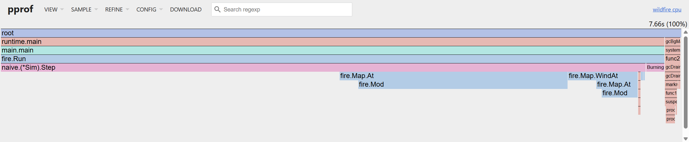
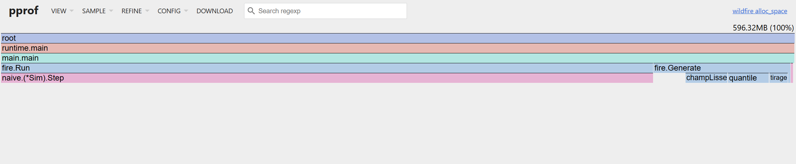

# Rapport d'audit de performance — Jeu de la vie

> **Équipe :** … — **Session :** E42 — **Dépôt :** … (commit final : `…`)
>
> Consigne de rédaction : chaque affirmation chiffrée renvoie à un fichier de `results/`.
> Rédiger chaque section **juste après** la mesure correspondante, jamais à la fin.

## Résumé exécutif

Trois phrases : point de départ (débit baseline en cellules/s), point d'arrivée, facteur de gain global et les deux leviers principaux.

---

## 1. Environnement & métrologie (baseline) — /3

### 1.1 Banc d'essai matériel

Cette section documente la campagne du 22 septembre 2026 sur Mac.
Source : [env.md](../results/20260922-232134-6fc36f2/env.md).
Le relevé Intel/WSL précédemment présent est conservé dans
[ENVIRONNEMENT-WSL.md](ENVIRONNEMENT-WSL.md) ; il ne décrit pas cette campagne.

| Élément | Valeur relevée |
|---|---|
| CPU | Apple M1 |
| Cœurs physiques / logiques | 8 / 8 |
| RAM | 8 Gio |
| Système | macOS 15.5, build 24F74 |
| Runtime Go | go1.27.1, darwin/arm64 |
| CGO_ENABLED | 1 |
| GOGC | Valeur par défaut : 100 |
| GOMAXPROCS | Variable non définie |
| Hyperfine | 1.20.0 |
| Ligne de cache | 128 octets |
| Cache L1 instructions | 128 Kio |
| Cache L1 données | 64 Kio |
| Cache L2 | 4 Mio |

Les valeurs de cache sont celles rapportées par le script ; elles ne décrivent
pas exhaustivement la topologie du processeur. Le cache L3 n'est pas renseigné.
L'alimentation, la fréquence CPU et la fermeture des autres applications ne sont
pas documentées dans ce relevé.

La campagne référence le commit `6fc36f2`, avec des modifications non commitées
signalées par le script. Ce commit seul ne permet donc pas de reconstituer
exactement l'état des sources mesurées.

### 1.2 Protocole de mesure

La mesure globale utilise une grille de 1024 × 1024 cellules, une graine de 42,
une densité initiale de 0,3 et un maximum de 50 générations. La détection de cycles
est activée et les snapshots sont désactivés.

Les tests de conformité précèdent la compilation et les mesures. Hyperfine
exécute le binaire sans shell intermédiaire (`-N`), avec 3 exécutions
d'échauffement puis 15 exécutions mesurées. L'échauffement vise à réduire les
effets du démarrage ; il ne garantit pas une fréquence CPU constante.

Hyperfine mesure l'exécution complète du processus, y compris la création de la
grille initiale. Le chronomètre interne de `gol` exclut cette création : ces deux
périmètres ne doivent pas être confondus.

Les micro-benchmarks Go sont répétés 10 fois avec `-benchmem` : ils mesurent
séparément `Step`, `Fingerprint` et une simulation complète (`Run`). Pour `Step`,
la préparation du moteur est hors chronométrage et la grille évolue au fil des
itérations. Pour `Fingerprint`, la grille initiale reste fixe. Ces deux mesures
ne portent donc pas sur la même succession d'états.

Sources : [script de mesure](../scripts/run_benchmarks.sh),
[benchmarks](../internal/bench/bench_test.go),
[tests de la campagne](../results/20260922-232134-6fc36f2/tests.txt).

### 1.3 Mesures de référence

Source : [statistiques Hyperfine](../results/20260922-232134-6fc36f2/hyperfine-stats.md).

| Indicateur | Version naive |
|---|---:|
| Temps moyen | 2,1231 s |
| Médiane | 2,1204 s |
| Écart-type | 0,0217 s |
| Variance | 0,0004698 s² |
| Minimum | 2,0932 s |
| Maximum | 2,1649 s |
| Coefficient de variation | 1,0 % |

Le coefficient de variation de 1 % indique une faible dispersion sur cette
campagne de 15 exécutions. Il ne prouve pas l'absence de biais systématique.
Ces résultats constituent la référence avant optimisation ; aucune accélération
n'est encore démontrée par cette campagne qui ne mesure que `naive`.

---

## 2. Diagnostic matériel & profiling réel — /5

### 2.1 Profil CPU de la baseline

Sources : [profil CPU](../results/profiles/naive-cpu-top.txt) et
[coût par ligne](../results/profiles/naive-cpu-list.txt).

Le profil daté du 21 septembre provient d'une exécution distincte de la campagne
du 22 septembre. Il couvre 2,32 s d'exécution, avec 1,96 s d'échantillons CPU.
Les pourcentages ci-dessous portent sur les échantillons CPU, pas sur le temps
écoulé mesuré par Hyperfine.

| Fonction | Part directe (`flat`) | Part appels inclus (`cum`) |
|---|---:|---:|
| `neighbors` | 29,08 % | 29,08 % |
| `Step` | 6,12 % | 35,71 % |
| `Fingerprint` | 0,51 % | 11,22 % |
| `runtime.madvise` | 42,86 % | 42,86 % |

Le coût de `neighbors` est inclus dans celui de `Step` : les pourcentages cumulés
ne s'additionnent pas. La part importante de `runtime.madvise` mérite une
investigation ; ce profil seul ne permet pas de l'attribuer entièrement au GC.




### 2.2 Profil d'allocations

Source : [micro-benchmarks bruts](../results/20260922-232134-6fc36f2/bench.txt).

| Opération, grille 1024 × 1024 | Octets alloués par opération | Allocations par opération |
|---|---:|---:|
| Une génération (`Step`) | Environ 1 075 840 o | 1 025 |
| Une empreinte (`Fingerprint`) | Environ 22,2 Mo | Environ 786 000 |

Ces volumes représentent les allocations cumulées par opération, pas la mémoire
occupée simultanément. Le résultat de `Fingerprint` concerne la grille initiale
fixe du micro-benchmark ; il ne peut pas être multiplié directement par le nombre
de générations pour prédire les allocations d'une simulation qui évolue.

Dans le [profil d'allocations](../results/profiles/naive-mem-top.txt),
`Fingerprint`, appels inclus, représente 92,02 % des octets alloués et `Step`
7,50 %. Les allocations de `fmt.Sprintf` et de `strings.Builder` sont déjà
incluses dans le total de `Fingerprint`.

Une mesure spécifique du temps et des pauses GC reste à réaliser. Les allocations seules ne permettent pas de quantifier ces pauses.



### 2.3 Identification des opérations coûteuses

Source du diagnostic : [moteur naive](../internal/naive/naive.go), confronté aux
mesures des sections 2.1 et 2.2.

- **Reconstruction de la grille.** `Step` alloue une nouvelle grille à chaque
  génération : un tableau de lignes et 1 024 lignes pour une grille de hauteur
  1 024. Cela explique les 1 025 allocations mesurées. La réutilisation de deux
  buffers constitue une hypothèse d'optimisation à tester.
- **Construction de l'empreinte.** `Fingerprint` appelle `fmt.Sprintf` pour
  chaque cellule vivante, assemble les coordonnées dans une chaîne puis la
  convertit en octets pour calculer SHA-256. Le formatage et les buffers
  intermédiaires expliquent son volume important d'allocations. Une empreinte
  calculée directement sur la grille est une piste à mesurer.
- **Comptage des voisins.** `neighbors` parcourt huit voisins et effectue deux
  opérations modulo par voisin pour relier les bords, soit seize opérations
  modulo dans le code par cellule. Son coût CPU observé justifie d'étudier ce
  calcul. La grille `[][]bool` ajoute une indirection entre le tableau de lignes
  et chaque ligne ; un effet sur les défauts de cache n'est pas encore mesuré.

Ces observations identifient des pistes ; elles ne démontrent pas encore de gain.
Les optimisations seront validées par les tests puis comparées sur la même machine
et avec les mêmes paramètres.

---

## 3. Journal d'optimisation — /5

Une entrée par étape, toujours au même format :

> **Étape N — titre** (commit `…`)
> - **Hypothèse d'impact matériel :** …
> - **Modification :** …
> - **Commande de vérification :** `…`
> - **Résultat :** avant → après (benchstat, avec p-value) ; allocs/op avant → après.
> - **Explication physique :** …

### Étape 1 — Grille contiguë et deux buffers (`flat`)

**Hypothèse :** remplacer les lignes séparées par une grille contiguë et
réutiliser deux buffers supprime les 1 025 allocations de `Step` par génération
sur une grille 1024 × 1024. Le gain de temps doit être mesuré.

**Modification :** nouveau package `internal/flat`, enregistré dans le registre
commun. `Step` remplit le second buffer puis échange les deux grilles. La baseline
`naive` et la référence `lifetest` restent intactes. Pour isoler cette étape, les
modulos et le calcul SHA-256 à partir de coordonnées formatées sont conservés :
exception expérimentale aux interdits du hot path de `constitution.md`, limitée
à cette comparaison. Les allocations de `Fingerprint` restent donc présentes.

**Validation :** `go test ./... -count=1` passe, incluant la suite de conformité
pour `flat` et un test d'indépendance des buffers vis-à-vis de l'entrée.

**Commande de mesure :**

```bash
go test ./internal/bench -run '^$' -bench 'BenchmarkStep/impl=.*/size=1024$' -benchmem -count 10
benchstat -col /impl results/flat-step-initial/bench.txt
go build -gcflags=-m ./internal/flat
```

**Première mesure locale sur Apple M1 :**

| Moteur | Temps médian par génération | Octets alloués/génération | Allocations/génération |
|---|---:|---:|---:|
| naive | 22,48 ms | Environ 1 075 840 o | 1 025 |
| flat | 21,88 ms | 0 o | 0 |

Sources : [mesures brutes](../results/flat-step-initial/bench.txt),
[benchstat](../results/flat-step-initial/benchstat.txt),
[analyse d'échappement](../results/flat-step-initial/escape.txt).

Le temps de `flat` est inférieur d'environ 2,65 % à celui de `naive`
(p = 0,002, dix mesures par moteur). Attention : le tableau benchstat place
`flat` en référence et affiche donc `naive` à +2,72 % ; le dénominateur diffère.
L'objectif de zéro allocation dans `Step` est atteint. Les allocations initiales
des deux buffers sont hors du chronométrage de ce micro-benchmark ; cette
propriété ne s'étend ni à `New`, ni à `Fingerprint`, ni à la simulation complète.

La réutilisation supprime la création et l'abandon d'une grille à chaque étape.
L'analyse d'échappement documente les allocations du constructeur et de
l'empreinte ; aucun gain de pauses GC ou de défauts de cache n'est établi ici.
Les mesures ont été réalisées avant commit sur la branche `cherif/optim-flat`.
Le code et les preuves sont conservés ensemble dans le commit intitulé
« Ajoute le moteur flat et documente sa comparaison à naive ».

**Campagne complète :** `make bench`, dossier
[`20260922-235916-ae93e40`](../results/20260922-235916-ae93e40/).
Le suffixe `ae93e40` désigne le HEAD avant commit des modifications mesurées,
et non un commit contenant déjà `flat`.

Les [tests de conformité](../results/20260922-235916-ae93e40/tests.txt)
passent. Les [micro-benchmarks](../results/20260922-235916-ae93e40/benchstat.txt)
confirment les résultats suivants (médianes, dix mesures par moteur) :

| Opération | naive | flat | Réduction du temps par rapport à naive |
|---|---:|---:|---:|
| Step, 256 × 256 | 1,273 ms | 1,229 ms | Environ 3,4 % |
| Step, 1024 × 1024 | 22,37 ms | 21,56 ms | Environ 3,6 % |
| Step, 2048 × 2048 | 95,46 ms | 91,98 ms | Environ 3,6 % |
| Fingerprint, 1024 × 1024 | 31,20 ms | 30,98 ms | Environ 0,7 % |
| Run, 512 × 512, 50 générations maximum | 511,5 ms | 501,0 ms | Environ 2,1 % |

Les différences de temps sont significatives dans cette campagne : p = 0,001
pour Step à 256, et p < 0,001 pour les autres lignes (affichées `p=0.000`
par benchstat après arrondi). Les pourcentages ci-dessus prennent `naive` comme
référence, contrairement aux colonnes de benchstat qui prennent `flat`.

`Step` n'alloue plus sur les trois tailles testées. En revanche, `Fingerprint`
conserve environ 786 000 allocations et 22,2 Mo par appel. Pour `Run` à 512,
le volume alloué passe d'environ 159,0 Mo à 145,4 Mo, soit une baisse de 8,5 %.
La suppression des allocations de grille ne rend donc pas la simulation complète
sans allocation.

La [mesure Hyperfine](../results/20260922-235916-ae93e40/hyperfine-stats.md)
compare les exécutions complètes sur 1024 × 1024 et 50 générations maximum :

| Moteur | Moyenne | Médiane | Écart-type | CV |
|---|---:|---:|---:|---:|
| naive | 2,1576 s | 2,1500 s | 0,0408 s | 1,9 % |
| flat | 2,0687 s | 2,0596 s | 0,0148 s | 0,7 % |

Le temps moyen diminue de 4,12 %, soit une accélération de ×1,043.
Ce rapport de moyennes n'est pas une p-value ; les tests statistiques ci-dessus
concernent les micro-benchmarks. Les valeurs `×1.0` du fichier de statistiques
sont arrondies à une décimale et prennent le premier moteur, `flat`, comme
référence. La comparaison retenue ici utilise `naive` de la même campagne,
pas les 2,1231 s de la campagne précédente.

Le gain global reste modeste : le comptage des voisins et la construction de
l'empreinte sont conservés. La prochaine hypothèse à tester concerne la
suppression du formatage et des allocations de `Fingerprint`.

### 3.1 Mémoire & localité de cache

- Grille plate `[]uint8` + double buffering (zéro allocation par génération).
- Suppression des modulos : lignes fantômes ou traitement séparé des bords.
- Bit-packing : 64 cellules par `uint64`, comptage des voisins par opérations bit à bit ; empreinte mémoire ÷ 8, une ligne de 1024 cellules = 128 o = 2 lignes de cache.
- Struct padding : `unsafe.Sizeof(Sim{})` 72 o → 56 o (`make layout`).
- Empreinte sans allocation : hachage FNV-1a direct sur les mots de la grille (`make escape` pour prouver l'absence d'échappement).

### 3.2 Concurrence & scalabilité CPU

- Worker pool : découpage en bandes horizontales, nombre de workers = cœurs **physiques** (justifier contre les threads SMT).
- Synchronisation : `sync.WaitGroup` par génération ou barrière ; population comptée avec `atomic.Int64`.
- Arrêt précoce : `context.WithCancel` / `WithTimeout`, annulation dès détection d'un cycle.
- Courbe de scalabilité : temps en fonction du nombre de workers (1, 2, 4, …), comparée à la loi d'Amdahl.

### 3.3 I/O réseau & persistance

- Snapshots : JSON `[][]bool` → Protobuf / format bit-packé (taille fichier et temps de sérialisation).
- PostgreSQL : historique (génération, empreinte, population) ; requête de détection de cycle sans puis avec index (`EXPLAIN ANALYZE` avant/après).
- Cache : LRU des empreintes déjà vues ; `sync.Pool` pour les buffers de sérialisation.

---

## 4. Confrontation critique & échec constructif — /3

> **Tentative :** … (ex. une goroutine par cellule, ou bandes trop fines → *false sharing*)
> - **Hypothèse initiale :** …
> - **Mesure :** régression de x % (benchstat, commit `…`)
> - **Explication mécanique chiffrée :** coût d'ordonnancement d'une goroutine (~µs) × 1 M cellules vs coût du calcul d'une cellule (~ns) ; ou invalidations de lignes de cache entre cœurs (compteurs `perf stat -e cache-misses` si disponible).
> - **Retour arrière :** commit `…` (git revert)

---

## 5. Reproductibilité & synthèse comparative — /4

### 5.1 Reproduire toutes les mesures

```bash
git clone … && cd gol
make tools   # benchstat
make bench   # env + tests + go bench + hyperfine + benchstat -> results/<date>-<commit>/
```

### 5.2 Tableau de synthèse

Sources : [benchstat](../results/20260922-235916-ae93e40/benchstat.txt)
et [Hyperfine](../results/20260922-235916-ae93e40/hyperfine-stats.md).

| Version | Temps moyen (1024², 50 générations maximum) | Allocations par Step (1024²) | Accélération globale relative à naive |
|---|---:|---:|---:|
| naive | 2,1576 s | 1 025 | ×1,000 |
| flat + double buffer | 2,0687 s | 0 | ×1,043 |

Le temps global inclut le processus complet ; le nombre d'allocations par Step
provient du micro-benchmark isolé. Les versions bitpack et parallel ne sont pas
encore implémentées ni mesurées. Aucun compteur matériel ne permet à ce stade
de conclure à une limite de bande passante mémoire ou de calcul.

---

## 6. Bonus — gouvernance IA

Voir `constitution.md` à la racine du dépôt. Expliquer en quelques lignes comment il a été utilisé pendant le TP.
