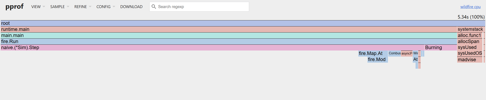
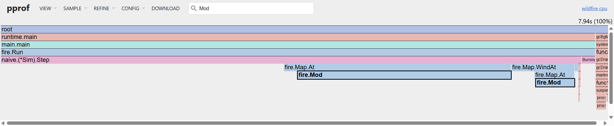
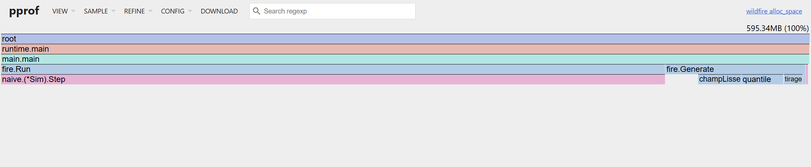
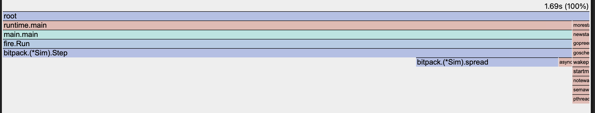

# Rapport d'audit technique — Wildfire

**Sup de Vinci • RNCP Bloc 4 — Optimisations & Performances Backend • Session E42**

*Simulation d'incendie de forêt haute performance en Go*

> **Description fonctionnelle du système**
>
> Wildfire est un automate cellulaire multi-états simulant la propagation d'un incendie sur un tore.
> Chaque case porte un terrain (eau, plaine, forêt), un vent éventuel, et deux compteurs — tours de
> combustion restants, tours de repos. La grille est mise à jour de façon synchrone en voisinage de
> Moore ; le vent porte le feu à deux cases dans sa direction, y compris par-dessus l'eau, et épargne
> le secteur amont. Les règles complètes tiennent dans `internal/fire/REGLES.md`.
>
> Ce document consigne l'audit micro-architectural du système en deux volets : le reporting factuel
> des mesures et du protocole statistique, puis l'analyse des choix d'ingénierie matérielle, des
> échecs constructifs et de la gouvernance technique.

**Binôme • 28 septembre 2026 • Dépôt :** `github.com/Antoine-Ferron/jdv-opti`

---

# Partie I — Reporting, métrologie & résultats

## 1.1 Bancs d'essai matériel & rigueur métrologique

Deux machines, mesurées à chaque étape. Le **banc A fait foi** ; le **banc B** sert de témoin de
portabilité — ce sont les gains qui ne survivent pas au changement d'architecture qui en disent le
plus sur le matériel.

| Composant | Banc A — référence | Banc B — témoin |
|---|---|---|
| **Processeur** | Apple M1, 8 cœurs (4 performance + 4 efficience) | Intel Core Ultra 9 275HX, 24 cœurs / 24 threads |
| **Caches** | L1d 64 Ko • L1i 128 Ko • L2 4 Mo • ligne 128 o | L1d 48 Ko • L1i 64 Ko • L2 3 Mo • L3 36 Mo • ligne 64 o |
| **Mémoire** | 8 Gio unifiée | 31 Gio exposés à WSL2 (64 Gio hôte) |
| **Système** | macOS 27.0 (26A428) | Ubuntu 26.04 LTS sur WSL2, noyau 6.6.114.1 |
| **Runtime** | Go 1.27.1 `darwin/arm64` | Go 1.27.1 `linux/amd64`, GOAMD64 v1 |
| **Protocole** | benchstat `n=10` • Hyperfine `-N --warmup 3 --runs 15` | idem |

**Rigueur statistique.** Chaque version est mesurée dix fois par benchstat (p-values reportées) et
quinze fois par Hyperfine après trois itérations de chauffe, avec `-N` pour supprimer le shell
intermédiaire. Seuil de coefficient de variation fixé à **2 %** ; toute mesure au-dessus est signalée
comme réserve. Une campagne lancée sur un arbre de travail modifié est refusée par le script.

**Réserves assumées.** Le banc A est un MacBook Air à refroidissement passif : sa baseline dérive
jusqu'à 3,2 % de CV selon les campagnes. Le banc B tourne sous WSL2, donc sous Hyper-V. Ces deux
limites interdisent de comparer les *temps absolus* entre bancs ; seuls les **ratios** le sont, et ce
rapport ne met jamais les deux machines en regard autrement.

## 1.2 Domaine de simulation & dimensionnement

| Taille | Cases | Empreinte grille (baseline) | Rôle dans l'audit |
|---|---:|---:|---|
| 256² | 65 536 | 128 Ko | Détection des régressions de petite grille |
| **1024²** | **1 048 576** | **2 Mo** | **Charge de référence — dépasse le L2 des deux bancs** |
| 2048² | 4 194 304 | 8 Mo | Vérification du comportement hors cache |

Deux régimes, qui ne désignent pas les mêmes goulots :

| Scénario | Foyers | Comportement | Ce qu'il met sous tension |
|---|---:|---|---|
| `embrasement` | 64 | La carte brûle partout | Le corps de `Step`, le coût par case |
| `front` | 1 | Un seul front actif, grille creuse | Le balayage inutile des cases éteintes |

## 1.3 Tableau comparatif des mesures brutes

Binaire complet, 1024², 64 foyers, 500 tours, 15 répétitions, campagne `73d23bd` — **les cinq
versions mesurées dans une même session**, seule façon d'obtenir des ratios non contaminés par la
dérive machine.

| Version | Stratégie | Banc A | CV | Banc B | CV | allocs/`Step` | **Cumul A** | **Cumul B** |
|---|---|---:|---:|---:|---:|---:|---:|---:|
| **V0** `naive` | Baseline `[][]Cell`, 2 o/case, tampon par tour | 6,3078 s | 2,2 % | 8,1219 s | 0,5 % | 1 | ×1 | ×1 |
| **V1** `flat` ⚠ | Grille contiguë, double tampon réutilisé | 6,3107 s | 0,4 % | 8,1420 s | 0,9 % | 0 | **×0,999** | **×0,998** |
| **V2** `counters` | Compteur de cases en feu incrémental | 5,9540 s | 0,2 % | 7,7421 s | 1,0 % | 0 | ×1,059 | ×1,049 |
| **V3** `ghost` | Bordure fantôme, plus aucun modulo | 5,0587 s | 0,4 % | 4,5180 s | 1,3 % | 0 | ×1,247 | ×1,798 |
| **V4** `bitpack` ★ | États et propagation par plans de bits | **0,5913 s** | 1,6 % | **0,7619 s** | 1,3 % | 0 | **×10,67** | **×10,66** |
| **V5** `front` ⚠ | Liste des cases actives, balayage restreint | *(à relancer)* | — | 8,2312 s | 0,4 % | 0 | — | **×1,002** |

⚠ régression • ★ version retenue

V5 est mesurée à la campagne `981c735`, postérieure. Sa colonne banc A est en attente : la campagne
de ce banc affichait des CV de 10 à 21 %, très au-dessus du seuil, et doit être rejouée au calme.
La direction n'est pas en cause — sur les deux bancs, `front` ramène le binaire au niveau de la
baseline en régime saturé — mais aucun chiffre précis n'en est citable.

**V5 est le cas le plus instructif du projet parce qu'elle se contredit selon l'échelle
d'observation** (banc B, campagne `981c735`) :

| Mesure | `bitpack` | `front` | Verdict |
|---|---:|---:|---|
| `Run`, scénario creux, 1024² | 11,89 ms | **3,78 ms** | **×3,1 en faveur de V5** |
| `Step`, embrasement, 1024² | 175 µs | 11 159 µs | ×64 contre |
| Binaire, embrasement 500 tours | 0,7661 s | 8,2312 s | ×10,7 contre |
| Binaire, régime creux 50 tours | 686,8 ms | 686,5 ms | indistinguable |

L'étape **fait exactement ce pour quoi elle a été écrite** — diviser par trois le coût de la
simulation quand la grille est creuse — et reste **invisible de bout en bout**, parce que la
génération de carte seule coûte 682,3 ms sur les 686,5 du binaire dans ce régime, soit **99,4 %**.
Elle annule par ailleurs toute la chaîne en régime saturé : maintenir une liste de cases actives
quand tout brûle revient à payer la gestion de la liste en plus du travail, et à perdre la
propagation par mots de 64 bits qui fait l'intérêt de V4.

**Aucune version n'est donc la meilleure dans les deux régimes** — ce que le §1.2 anticipait en en
définissant deux. Mesuré sur le seul embrasement, `front` aurait été jeté à tort.

**Débit.** De 8,31 × 10⁷ à 8,87 × 10⁸ cases/s sur le banc A ; de 6,46 × 10⁷ à 6,88 × 10⁸ sur le banc B.

**Microbenchmark `Step`**, embrasement 1024², banc B : 12 474 µs (V0) → **172,0 µs** (V4), soit
**×72,5**. L'écart avec le ×10,66 du binaire est analysé au §2.4.

**Le fait le plus instructif du tableau** : les étapes prises une à une dépendent fortement de
l'architecture — `ghost` rend ×1,80 sur le banc B contre ×1,25 sur le banc A, `bitpack` fait
l'inverse — mais **les cumuls convergent à deux millièmes**. Là où une machine avait peu à gagner sur
le modulo, elle avait davantage à gagner sur la compacité. Aucune machine seule ne l'aurait montré.

Sources : [banc A](../results/73d23bd/m1-air/hyperfine-stats.md) •
[banc B](../results/73d23bd/x86-controle/hyperfine-stats.md) •
[benchstat](../results/73d23bd/x86-controle/benchstat.txt) • [V5 banc B](../results/981c735/x86-controle/hyperfine-stats.md) • [V5 régime creux](../results/981c735/x86-controle/front50-hyperfine.md)

## 1.4 Représentation graphique



*Figure 1.1 — Flamegraph CPU de `naive` sur le banc A : `Step` occupe 95,30 % du temps cumulé.*



*Figure 1.2 — Même code, banc B : `fire.Mod` encadré occupe 37,19 % à lui seul, contre 9,20 % sur le
banc A. C'est cet écart qui rend l'étape `ghost` quatre fois plus rentable sur x86.*



*Figure 1.3 — Profil `alloc_space` de `naive` : 489 Mo alloués dans `Step`, soit 82,26 % du total —
un tampon de 1 Mio par tour, jamais réutilisé.*



*Figure 1.4 — Profil de la version retenue sur 10 000 tours : `Step` reste le seul poste
(97,04 % cumulé), mais sur un volume de travail divisé par 72.*

## 1.5 Axe I/O — sérialisation, persistance, cache

Volet mené indépendamment de la chaîne CPU : les snapshots restent **hors du chemin chronométré**,
exactement comme le rendu console, si bien qu'aucune mesure du §1.3 n'en dépend.

**Formats de sérialisation**, état 1024², banc B :

| Format | Temps d'écriture | Taille | Octets/case | Gain de taille |
|---|---:|---:|---:|---:|
| JSON (baseline) | 534,7 ms | 120,4 Mo | 114,8 | ×1 |
| Protobuf | 13,84 ms | 4,19 Mo | 4,0 | ×29 |
| **Binaire bit-packé** | **1,338 ms** | **1,57 Mo** | **1,5** | **×77** |
| Binaire, décor omis | 0,849 ms | 524 Ko | 0,5 | **×230** |

Le décor étant immuable, il n'est écrit que dans le premier snapshot d'une série : c'est là que se
joue le dernier facteur 3, hors de portée de Protobuf dont le varint occupe un octet minimum.

**Persistance PostgreSQL** (17.11 en conteneur, banc B) :

| Mesure | Sans | Avec | Gain |
|---|---:|---:|---:|
| 500 insertions : unitaires → un `COPY` | 83,35 ms | 6,565 ms | **×12,7** |
| 5 000 insertions | 1,033 s | 54,38 ms | **×19,0** |
| Requête sur 500 000 lignes, empreintes uniques | 8 257 µs | 176,5 µs | **×46,8** |
| Même requête, empreintes répétées 1/10 | 8 776 µs | 4 567 µs | ×1,9 |
| Même requête, 200 lignes | 147,5 µs | 148,3 µs | aucun |

`EXPLAIN (ANALYZE, BUFFERS)` donne le mécanisme : `Seq Scan` sur 192 pages → `Index Only Scan` sur
3 pages. **Un index ne se juge pas au nombre de lignes mais à la sélectivité du prédicat** — à
volume et index identiques, ×46,8 contre ×1,9 selon la distribution des empreintes.

**Cache mémoire** — `sync.Pool` sur les tampons de sérialisation : −99,9 % d'octets alloués sur les
deux bancs, mais **−6 à −22 % de temps sur le banc B et rien sur le banc A** (−1,9 % au mieux). Le
gain venait de la remise à zéro évitée et du travail du ramasse-miettes, deux coûts de bande
passante mémoire dont le M1 dispose plus largement.

Sources : [formats](../results/ae8b974/x86-controle/benchstat.txt) •
[base](../results/8a71072/x86-controle/benchstat-store.txt) •
[plans](../results/8a71072/x86-controle/explain-store.txt) •
[pool A](../results/d533e30/m1-air/benchstat-pool.txt) •
[pool B](../results/935ffbc/x86-controle/benchstat-pool.txt)

## 1.6 Reproductibilité

```bash
make tools                      # benchstat
make bench-cpu BANC=<nom>       # env + conformité + build + benchstat + Hyperfine
make bench-io  BANC=<nom>       # bancs de sérialisation et de persistance
make profile IMPL=<v> BANC=<n>  # profils CPU et alloc_space
make db / make db-stop          # PostgreSQL en conteneur, sans volume
```

Chaque campagne produit `results/<commit-de-code>/<banc>/`. Le dossier porte **le dernier commit
ayant touché le code**, non `HEAD` : deux machines rangent ainsi leurs mesures au même endroit sans
se synchroniser sur un hash. Les tests d'intégration PostgreSQL sont **sautés** et non échoués quand
la base est absente, pour que `make test` reste vert sans Docker.

---

# Partie II — Diagnostic matériel & choix d'ingénierie

## 2.1 Diagnostic & identification du hot path

`go tool pprof` sur la baseline désigne trois verrous, et **leur hiérarchie diffère selon la
machine** — c'est le résultat qui a structuré tout le plan d'optimisation :

| Poste | Banc A | Banc B | Nature du coût |
|---|---:|---:|---|
| `Step` (corps) | 76,28 % | 48,78 % | Balayage complet, 8 voisins par case |
| **`fire.Mod`** | **9,20 %** | **37,19 %** | Enroulement torique par modulo, 8 par case |
| `Map.At` | 12,88 % cum. | inclus | Indirection `[][]Cell`, deux déréférencements |
| `Burning` | 3,27 % saturé / **21 %** en front | idem | Recompte la grille entière à chaque appel |

**1 — Pression sur le ramasse-miettes.** `Step` alloue un tampon de 1 Mio par tour, jamais réutilisé :
489 Mo cumulés sur 500 tours, soit 82,26 % des allocations du programme.

**2 — Division entière sur le chemin chaud.** Le modulo coûte 20 à 40 cycles et n'est pas
vectorisable. Sur x86 il représente plus du tiers du temps ; sur ARM, dont le diviseur est plus
rapide, moins du dixième. **Un même défaut de code ne pèse pas le même poids selon le silicium.**

**3 — Travail inutile en régime creux.** En scénario `front`, `Burning` recompte le million de cases
à chaque tour pour n'en trouver que quelques centaines allumées.

## 2.2 Choix d'ingénierie en 3 axes

**Axe 1 — Mémoire & localité de cache.** Grille contiguë `[]Cell` en remplacement de `[][]Cell`, deux
tampons permutés au lieu d'une allocation par tour (**0 alloc/`Step`**), puis représentation en
**plans de bits** : `feu` et `repos` tiennent chacun sur 2 bits, soit 4 bits par case contre 16.
Une ligne de cache de 64 octets porte alors 128 cases au lieu de 32, et la propagation traite
**64 cases par mot** de 64 bits par OU logique au lieu de répéter la logique par cellule. C'est
l'étape qui rend le facteur 10.

**Axe 2 — Concurrence & scalabilité CPU.** *Axe non traité dans l'état actuel du projet* — et ce
n'est pas un oubli mais une conséquence mesurée : depuis `bitpack`, la simulation ne pèse plus que
10 % du temps du binaire (§2.4), ce qui plafonne tout gain de parallélisation de `Step` à 10 % du
bout en bout, loi d'Amdahl. Le plan prévu — worker pool dimensionné aux **cœurs performance** (4 sur
le banc A) et non à `GOMAXPROCS`, agrégation du compteur par `atomic`, arrêt précoce à l'extinction,
courbe de scalabilité 1/2/4/8 — reste valide, mais s'appliquerait désormais à `fire.Generate`.

**Axe 3 — I/O réseau & persistance.** Trois formats comparés sur le même état (§1.5), le binaire
bit-packé l'emportant d'un facteur 77 sur JSON. Côté base, le coût dominant est **le nombre
d'allers-retours et non le volume** : un `COPY` remplace 500 requêtes et divise le temps par 12,7,
sur `localhost`, c'est-à-dire dans les conditions les plus défavorables à la démonstration. Le
`sync.Pool` supprime 99,9 % des octets alloués par snapshot, pour un gain en temps qui ne survit pas
au changement d'architecture.

## 2.3 Confrontation critique & échecs constructifs

| Tentative | Hypothèse | Gain constaté | Régression mesurée | Verdict |
|---|---|---|---|---|
| **V1** `flat` — double tampon | Supprimer les allocations par tour réduit le temps | 0 alloc/`Step`, −489 Mo | ×0,998 banc B, ×0,999 banc A | **Conservée** comme socle, gain nul assumé |
| **Index SQL** — seuil annoncé | Un ordre de grandeur « dès quelques dizaines de milliers de lignes » | ×46,8 à 500 000 lignes | ×3,9 seulement à 20 000 : seuil sous-estimé ×25 | **Hypothèse partiellement réfutée** |
| **Déduplication** de snapshots | Éviter de réécrire un état déjà vu doit rapporter plus que le pool | −55,9 % sur `proto` | **+73,6 % sur `packed`** | **Écartée par défaut** |
| **`sync.Pool`** — portabilité | Le gain tient au volume alloué, donc il vaut partout | −6 à −22 % banc B | non significatif banc A | **Conservée**, gain non portable |
| **`counters`** en 256² | Le compteur incrémental ne coûte rien | −5,9 % en 1024² | +1,8 % sur `Step` en 256², banc A | **Conservée**, compromis local documenté |
| **V5** `front` — liste des cases actives | Ne balayer que les cases actives doit gagner en régime creux | **×3,1** sur la simulation creuse | **×64 sur `Step` saturé**, binaire ramené à la baseline | **Non retenue par défaut**, conservée comme variante de régime |

**Échec n°1 — L'optimisation qui supprime des allocations sans gagner de temps.** `flat` atteint zéro
allocation par `Step` et **régresse** de 0,2 %. Le second tampon ajoute 2N octets de stockage
persistant et modifie les accès mémoire. *Enseignement : réduire le volume cumulé alloué ne garantit
ni une réduction du temps CPU, ni une réduction du pic de mémoire.*

**Échec n°2 — Deux optimisations d'un même axe qui se neutralisent.** La déduplication devait
supprimer la sérialisation entière des snapshots redondants. Elle y parvient — 72,64 % d'écritures
évitées — et reste **perdante sur le format retenu** : l'empreinte coûte 27 µs, l'écriture `packed`
qu'elle évite n'en coûte que 19. *Les étapes précédentes de l'axe avaient rendu la sérialisation si
peu coûteuse qu'elles ont retiré sa raison d'être à celle-ci. Une optimisation ne se juge pas dans
l'absolu mais contre l'état du code au moment où on l'évalue.*

**Trois pièges de périmètre, tous rencontrés et tous chiffrés.** Une mesure ne vaut que si son
périmètre est celui du changement :

| Piège | Ce qu'annonçait la mesure | Réalité | Cause |
|---|---|---|---|
| `BenchmarkRun` sur `flat` | ×3,4 | ×1,12 | Le banc reconstruisait le moteur à chaque itération (1 076 allocations) |
| Hyperfine `front 50` sur `counters` | +3,2 % | +21,8 % | 88 % de la mesure était de la génération de carte |
| Hyperfine `front 50` sur V5 | aucun gain | ×3,1 sur la simulation | 99,4 % de la mesure était de la génération de carte |
| Banc d'empreinte | 0,150 ms | 1,785 ms | Résultat jamais lu : le compilateur supprimait le calcul |

Le troisième s'est trahi par une grandeur physique impossible — 0,15 ns par case, soit moins d'un
cycle pour deux multiplications dépendantes. **Un banc dont le résultat n'est jamais lu ne mesure
rien**, et la seule défense est de ramener chaque temps à une grandeur physique avant d'y croire.

## 2.4 Bascule du goulot & étape logique suivante

Le microbenchmark `Step` gagne ×72,5 quand le binaire n'en gagne que ×10,66. L'écart n'est pas une
contradiction : c'est la **génération de carte**, que ces optimisations ne touchent pas. Mesurée
directement à zéro tour sur le banc B :

| | Temps | Part du binaire |
|---|---:|---:|
| Génération de la carte (bruit lissé + quantiles) | 686,2 ms | **90 %** |
| Simulation, 500 tours | ~75,7 ms | 10 % |

Rapportée à la seule simulation, la chaîne rend donc **×98** — de 7 436 ms à 76 ms.

**Conséquence, et elle est contraignante.** La loi d'Amdahl plafonne désormais toute optimisation de
`Step` à 10 % du temps de bout en bout — et à 0,6 % en régime creux, où la génération occupe 99,4 %
du binaire. L'étape V5 en fait la démonstration involontaire : elle divise par trois le coût de la
simulation creuse sans que le binaire ne bouge d'une milliseconde. La parallélisation de `Step`,
dernière étape du plan initial, bute sur le même plafond avant même d'être écrite.

**L'étape logique suivante est `fire.Generate`**, que rien n'a jamais touché, et elle porte deux
leviers indépendants : paralléliser `champLisse` par plages de lignes, et remplacer les quatre tris
complets de `quantile` par un quickselect, O(n) au lieu de O(n log n). Sur 24 threads, ramener 686 ms
à 100-200 ms porterait le binaire de ×10,66 à environ ×25.

**Cette bascule est elle-même le résultat le plus transférable de l'audit** : une chaîne
d'optimisations ne se planifie pas d'avance, elle se re-priorise à chaque profil. Le plan initial
désignait six étapes ; la quatrième a rendu les deux suivantes sans objet et a fait apparaître une
cible que le diagnostic initial ne voyait pas, parce qu'elle était alors invisible derrière un `Step`
soixante-douze fois plus lourd.

---

# Annexe — Gouvernance technique IA (`constitution.md`)

Fichier placé à la racine du dépôt, contraignant tout assistant de génération de code sur ce projet,
selon les quatre directives exigées.

**Directive 1 — Rôle et posture système stricts.** L'assistant agit en ingénieur système et
performance backend, gouverné par des métriques physiques réelles : cycles CPU, hiérarchie de cache,
bande passante mémoire, coût du ramasse-miettes. Priorité à la localité et à l'élimination des
allocations sur le chemin chaud.

**Directive 2 — Contraintes négatives explicites.** Sur le chemin chaud (`Step`, propagation,
`Fingerprint`) : `fmt.Sprintf` et la concaténation de chaînes bannis au profit de tampons fixes ;
goroutines non bornées interdites, worker pool dimensionné aux cœurs physiques ; conversions
`string` ↔ `[]byte` proscrites ; toute allocation sur le tas doit être justifiée ; aucun verrou
global.

**Directive 3 — Justification empirique obligatoire.** Toute proposition s'énonce comme un couple
indissociable : **hypothèse d'impact matériel** et **commande de profiling** qui la vérifie. Toute
affirmation non accompagnée de son protocole, ou contredite par benchstat, est rejetée — ce rapport
en contient cinq, dont trois réfutées par la mesure.

**Directive 4 — Formatage impératif et compact.** Injonctions précises et vérifiables, réponses
denses, zéro verbiage descriptif.

*Le fichier source complet est à la racine du dépôt sous `constitution.md`.*
